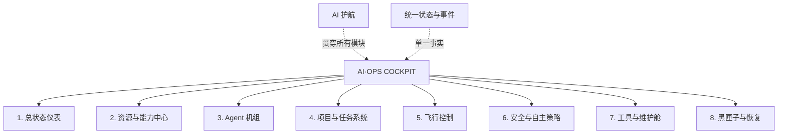
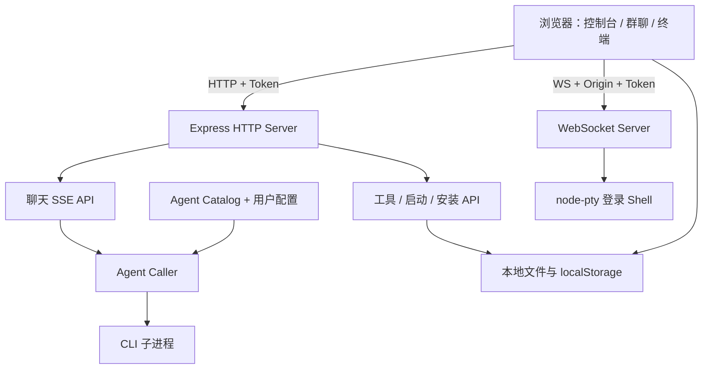

# AI·OPS COCKPIT 产品文档

> 文档性质：长期产品事实源 + 当前实现说明
> 当前代码版本：`2.0.0`（界面与包名仍保留 AI·OPS DECK，后续切片迁移）
> 当前目标版本：`v0.1-first-controlled-mission`
> 更新时间：2026-08-06
> 事实来源：当前仓库代码、已确认的[产品流程与架构总览](plans/2026-08-05-ai-ops-deck-overall-design-review-draft.md)及文末竞品资料

快速阅读：[产品定位](#1-一句话定义) · [产品全景](#3-产品目标与范围) · [模块边界](#4-目标信息架构与模块边界) · [当前功能](#5-当前功能清单) · [当前版本](NOW.md) · [完整流程图](diagrams/2026-08-05-ai-ops-cockpit-complete-product-flow-draft.md)

## 产品基线状态

- **状态**：已确认，可用于准备开发切片。
- **已确认范围**：产品定位、核心闭环、八模块唯一所有权、`v0.1-first-controlled-mission` 版本目标和明确非目标。
- **确认依据**：2026-08-05 的产品大纲确认、[完整产品流程图](diagrams/2026-08-05-ai-ops-cockpit-complete-product-flow-draft.md)与 [ADR-001](decisions/ADR-001-cockpit-module-boundaries.md)。
- **重新确认触发条件**：改变产品核心定位、第一次可控任务闭环、八模块所有权、local-first 边界，或把远程、多用户、多 Provider 等能力提前纳入当前版本。

基线确认只表示可以继续做切片设计，不代表任何切片已经达到开工标准；当前唯一切片状态仍以 [NOW.md](NOW.md) 为准。

## 0. 如何维护这份文档

本文件尽量把“已经实现的事实”和“未来建议”分开，避免规划被误认为现有能力。

- `✅ 已实现`：当前代码中存在，可直接使用。
- `🟡 部分实现`：有基础能力，但体验、可靠性或覆盖范围仍不完整。
- `🎯 已确认目标`：产品方向已经确认，但当前代码可能尚未实现。
- `⬜ 建议规划`：尚未确认进入版本，只能留在未来范围或想法池。
- 目标变化先更新第 1–4、13 节；代码能力变化更新第 5–9 节。
- 市场信息容易变化，竞争分析建议至少每季度复核一次。

---

## 1. 一句话定义

> **AI·OPS COCKPIT 是一个有 AI 护航的本地 Agent 运维驾驶舱：它把模型、Agent、项目、任务和本机工具组织成一套可观察、可操作、可干预、可追溯的 AI 工作系统。**

当前 `2.0.0` 代码仍是以工具发现、安装、多 Agent 群聊和 Web 终端为主的本地控制台。目标不是推倒重写，而是把这些已有能力迁入围绕“真实项目任务”的驾驶舱闭环。

## 2. 产品认知与战略判断

### 2.1 我对产品的核心认知

这个产品真正有价值的部分，不是“在网页里显示几个 AI 回复”，而是完成五层连接：

1. **护航层**：AI 理解当前状态，负责解释、配置、诊断和推荐下一步。
2. **接入层**：把不同模型、CLI Agent 和 Harness 能力接入统一适配边界。
3. **任务层**：所有执行围绕用户选择的项目和明确任务进行，而不是在用户主目录自由运行。
4. **控制层**：用户可以观察、暂停、继续、接管、终止和处理真正关键的决定。
5. **可信层**：项目边界、恢复点、统一状态、黑匣子和脱敏记录共同保证可追溯与可恢复。

因此，更准确的产品类别是：

> **Local-first Agent Operations Console（本地优先的 AI Agent 运维驾驶舱）**

### 2.2 应该服务谁

目标用户分为两个阶段：

- **初始用户**：会安装 App、复制 API Key，已经使用或想使用 AI 编码工具，但不想学习 CLI、配置文件和多个工具的运维方式。
- **长期用户**：只会表达想完成什么，不理解模型、Agent、终端和配置，也能在 AI 护航下安全使用专业 Agent 能力。

| 用户             | 主要痛点               | 产品价值                 |
| -------------- | ------------------ | -------------------- |
| AI 重度个人开发者 | CLI 多、窗口多、状态和费用分散 | 一个入口观察和控制所有本地 Agent |
| Vibe Coding 用户 | 不熟悉安装、配置、Git 和恢复 | AI 护航完成接入、边界保护和结果验收 |
| 独立开发者 / 一人公司 | 希望把任务交给 AI 后不中途空等 | 保守自主、关键决定队列和夜航报告 |

### 2.3 不建议成为的产品

- 不成为另一个 ChatGPT、通用 AI 工具箱或只负责聊天的外壳。
- 不成为完整 AI IDE；文件编辑、语言服务和调试器由现有工具负责。
- 不成为单纯的软件启动器或工具市场。
- 不把音频、图像、知识库等横向能力直接做进核心；它们只能作为未来可挂载能力。

最值得坚持的主线是：**围绕真实 CLI Agent 的安装、编排、观察、协作与安全执行形成闭环。**

---

## 3. 产品目标与范围

### 3.1 核心体验闭环

```text
打开驾驶舱
→ 在 AI 护航下接通模型和 Agent
→ 选择一个本地项目并提出真实目标
→ 建立安全边界与恢复点
→ Agent 执行，用户可以观察、暂停和接管
→ 用结果、文件变化或测试证据验收
→ 黑匣子记录全过程并支持恢复
```

### 3.2 产品全景

#### NOW：`v0.1-first-controlled-mission`

- macOS 本地网页驾驶舱；
- DeepSeek 作为第一个模型能源，护航 AI 独立于执行 Agent；
- Pi 作为第一个执行 Agent；
- 一个用户选择的 Git 项目；
- 一条可观察、可暂停、可终止、可验证、可恢复的真实任务；
- 最小统一状态、事件时间线、项目边界、恢复点和结果证据。

#### NEXT

- 非 Git 文件夹快照；
- 更多 Provider、Agent 和 Harness；
- 更完整的八模块页面与维护生命周期；
- 决定队列、常设规则和无人值守夜航；
- 多 Agent 机组在真实任务中的编排与合并。

#### LATER

- 远程网页控制和移动端只读/操作；
- 第三方插件接口与社区目录；
- Windows、Linux、团队协作和商业化能力。

#### NOT NOW

- 通用 AI 工具箱、完整 AI IDE、云端模型托管；
- 知识库平台、媒体工作流、图像生成和语音制作；
- 多用户企业权限、插件市场和公开稳定 SDK。

### 3.3 当前版本明确不做

- 不同时实现多个 Agent 的正式任务编排；现有群聊保留但不是 v0.1 主线。
- 不支持非 Git 项目的完整恢复，不承诺真正的系统级沙箱。
- 不做远程控制、移动端、插件生态、跨平台或团队协作。
- 不重写现有 Node / Express / WebSocket / SSE / node-pty 技术栈。
- 不在任务闭环成立前继续扩充工具目录或横向 AI 能力。

---

## 4. 目标信息架构与模块边界



八个模块保留，但所有权必须互斥：

| 模块 | 唯一职责 | 明确不负责 |
|---|---|---|
| 总状态仪表 | 汇总状态、告警、预算和唯一下一步 | 不保存配置、不执行任务、不拥有历史 |
| 资源与能力中心 | Provider、凭据、Harness 能力与兼容配置 | 不负责软件安装、更新、卸载和进程管理 |
| Agent 机组 | Agent 目录、能力、角色、当前机组与对话入口 | 不拥有项目任务状态和最终产物 |
| 项目与任务系统 | 项目边界、任务目标、执行批次和验收定义 | 不直接管理操作系统进程 |
| 飞行控制 | 启动、暂停、继续、接管、终止和进程监督 | 不决定安全政策、不长期保存审计历史 |
| 安全与自主策略 | 安全区、限制、保守自主、常设规则和关键决定 | 不保存原始日志、不实现历史浏览和恢复操作 |
| 工具与维护舱 | 发现、安装、健康检查、更新、修复、停用和卸载 | 不决定 Agent 分工或任务目标 |
| 黑匣子与恢复 | 事件、日志、Diff、检查点、报告与恢复操作 | 不决定动作是否被允许 |

AI 护航是贯穿能力，不是第九个业务模块。统一状态与事件是各模块共享的地基，不允许每个页面各自维护一套状态。

---

## 5. 当前功能清单

### 5.0 护航 AI（S01：已验收）

| 状态 | 功能 | 当前行为 |
|---|---|---|
| ✅ | DeepSeek 护航控制面 | 独立于 CLI Agent 调用链；可在 Pi 不可用时读取状态、检测连接并完成对话；已完成一次用户真实验收。 |
| ✅ | macOS Keychain 凭据管理 | Key 可保存、替换、删除；不进入命令参数、普通配置、浏览器持久化或应用日志；已完成用户真实验收与固定条目核对。 |
| ✅ | 可重复自动验证 | 62 项 Node 原生测试覆盖凭据、Provider、状态机、路由与护航 UI；另有 12/12 无写入 macOS PTY 探针。 |

本功能的当前验收状态与唯一下一步以 [NOW.md](NOW.md) 为准；实现决策见 [ADR-002](decisions/ADR-002-provider-control-plane-and-keychain.md)。

### 5.1 工具控制台

| 状态 | 功能 | 当前行为 |
|---|---|---|
| ✅ | 本机扫描 | 扫描 `/Applications`、`~/Applications`、PATH、npm 全局包和已知服务端口 |
| ✅ | 工具分类 | Agent、模型、聊天、编辑器、开发工具等分类展示 |
| ✅ | 搜索与筛选 | 可按名称、描述、命令等信息筛选 |
| ✅ | 启动应用 | 通过 macOS `open -a` 启动桌面应用 |
| ✅ | 启动命令 | 跳转到全屏终端并由用户确认执行，或按配置后台启动 |
| ✅ | 服务探活 | 对已知本地服务端口进行实时探测 |
| ✅ | 后台进程 | 查看和终止由控制台启动的后台命令 |
| 🟡 | 自动发现 | 主要依赖硬编码目录和启发式规则，未知工具的元数据有限 |

相关代码：[扫描器](../scripts/scan-tools.js)、[工具 API](../src/routes/tools.js)、[启动 API](../src/routes/launch.js)。

### 5.2 快捷安装

| 状态 | 功能 | 当前行为 |
|---|---|---|
| ✅ | 白名单安装目录 | 当前包含桌面 AI、编辑器、主流编码 CLI 和基础环境 |
| ✅ | 安装方式择优 | 优先 Homebrew，其次 npm 或官方 DMG / 页面 |
| ✅ | 实时安装日志 | 安装作为后台任务运行，前端轮询显示日志 |
| ✅ | 重复任务复用 | 同一安装任务运行时不会重复启动 |
| ✅ | 安装后刷新 | 自动刷新 Agent 可用性并重新扫描工具 |
| 🟡 | 失败恢复 | 有超时和错误信息，但没有自动诊断、重试或回滚 |
| 🟡 | 版本管理 | 只能判断“是否安装”，不能展示版本、更新或兼容性 |

相关代码：[安装目录](../src/install-catalog.js)、[安装任务](../src/routes/install.js)、[安装弹窗](../public/js/installer.js)。

### 5.3 多 Agent 群聊

| 状态  | 功能          | 当前行为                                                     |
| --- | ----------- | -------------------------------------------------------- |
| ✅   | 动态 Agent 列表 | 根据配置和 PATH 检测结果显示可用 / 未安装状态                              |
| ✅   | 多 Agent 并行  | 同一轮内同时调用所有目标 Agent                                       |
| ✅   | 顺序协作        | 后一个 Agent 可看到前面 Agent 的回复并补充或反驳                          |
| ✅   | 多轮讨论        | 支持 1–5 轮；后续轮次参考之前所有发言                                    |
| ✅   | `@` 定向      | 支持 `@agent`、`@all` 和键盘自动补全                               |
| ✅   | 模型选择        | 仅允许选择 Agent 配置白名单内的模型                                    |
| ✅   | 思考深度        | 将统一的 off / low / medium / high / max 映射到不同 CLI 参数        |
| ✅   | 流式输出        | 后端通过 SSE 返回 start、thinking、chunk、done、round、error、end 事件 |
| ✅   | 手动停止        | 中止 HTTP 请求并终止该请求创建的子进程                                   |
| ✅   | 本地历史        | 浏览器 `localStorage` 保存最多 50 个会话，可导出 Markdown              |
| 🟡  | 协作结果        | Agent 能看到前序回答，但没有固定的主持、投票、验收或最终综合步骤（我觉得要增加）              |
| 🟡  | 会话延续        | 保存的是页面消息，不是各 CLI 的原生会话；每次调用通常是新进程                        |

相关代码：[聊天路由](../src/routes/api.js)、[统一 Agent 调用器](../src/agent-caller.js)、[Agent 目录](../src/agent-catalog.js)、[群聊前端](../public/js/chat.js)。

### 5.4 全屏终端

| 状态  | 功能        | 当前行为                             |
| --- | --------- | -------------------------------- |
| ✅   | PTY Shell | 使用 `node-pty` 创建用户登录 Shell       |
| ✅   | 自适应尺寸     | 浏览器窗口变化时同步终端行列数                  |
| ✅   | 终端体验      | 支持主题、字号、复制、清屏、重启、URL 链接和状态栏      |
| ✅   | 命令确认      | `/terminal?run=` 带入的命令必须由用户确认后执行 |
| 🟡  | 权限隔离      | 没有容器或沙箱，权限等同于启动服务的本机用户（怎么补）      |

相关代码：[PTY 服务](../src/terminal.js)、[终端前端](../public/js/terminal.js)。

### 5.5 脚本化辩论

项目还提供独立的 [run-debate.js](../run-debate.js)，按照 [debate.json](../debate.json) 定义的角色、顺序和 Prompt 运行辩论，并增量写入 Markdown。这证明产品已有“配置驱动工作流”的雏形，但目前没有进入主界面，也没有抽象成通用流程编辑器。

### 5.6 语音输入输出（⬜ 建议规划） 目前使用微信输入法替代

定位先行：**语音只是群聊的输入输出通道，不是媒体能力。** 它服务三个具体场景：

- **输入**：双手被占用或不方便打字时，按住说话直接把问题丢进群聊。
- **输出**：多 Agent 讨论耗时较长，用户可以边做事边“听会”，流式生成一句就播报一句。
- **降门槛**：语音是“想用 AI 但不知道怎么入门”的最终用户最自然的交互方式，服务 2.2 节的长期愿景。

| 状态 | 功能 | 建议行为 |
|---|---|---|
| ⬜ | 语音输入 | 按住说话，实时转写为提问文本后发送；优先 macOS 原生识别或 whisper.cpp，保持本地优先 |
| ⬜ | 语音输出 | 随 SSE 流式分句播报 Agent 回复；支持暂停 / 停止、语速调节；多 Agent 时先报名字再播报 |
| ⬜ | 播报开关 | 默认关闭，逐 Agent 可控，避免多个 Agent 同时开口 |

**边界（防止滑向媒体工作流）：**

- 不做音频文件库：不管理、不检索、不组织录音和合成结果。
- 不做批量任务：不提供批量转写、批量配音、字幕生成。（但是可以配置给其他 cli）
- 不做编辑和导出：没有时间轴、剪辑、混音，不提供 MP3 / 播客导出。（暂时不做，）
- 不做音色市场：不承诺音色、情绪、方言定制，只保证“听得清”。
- 录音仅在内存中处理，默认不落盘、不上传，保持本地优先的隐私定位。
- **判断标准：任何语音需求如果离开“当前这场对话”仍然成立，就不属于本产品。**

---

## 6. 用户流程：目标与当前实现

### 6.1 目标核心流程（🎯 已确认）

```text
通电与最低必要校准
→ 选择一个本地项目
→ 提出真实目标
→ 建立项目边界、恢复点和预算
→ Agent 受控执行
→ 观察、暂停、接管或终止
→ 验收结果与证据
→ 查看黑匣子并按需恢复
```

任务卡、点火、地面测试和第一次试飞的具体交互继续在设计阶段解决，不从本节反推实现细节。

### 6.2 当前第一次使用（✅ 已实现）

1. 用户克隆项目并运行 `npm run setup`。
2. 安装脚本检查 macOS、Node.js、Xcode Command Line Tools 和端口。
3. 安装依赖并扫描本机工具。
4. 用户运行 `npm start`，访问 `http://localhost:3210`。
5. 控制台显示已安装工具；未安装的 Agent 可进入快捷安装。

### 6.3 当前多 Agent 协作（✅ 已实现）

1. 用户进入群聊。
2. 系统读取 Agent 配置并探测对应命令是否存在。
3. 用户选择 Agent、模型、并行 / 协作模式、思考深度和轮数。
4. 用户发送消息，也可通过 `@agent` 指定目标。
5. 后端清洗输入、拼接历史和 Persona，启动对应 CLI 子进程。
6. 输出经适配器解析后，以 SSE 实时推送到页面。
7. 每个 Agent 完成后，会话写入浏览器本地存储，并可导出 Markdown。

### 6.4 当前从工具卡片运行命令（✅ 已实现）

1. 用户点击工具卡片或快捷动作。
2. 对交互命令，系统打开 `/terminal?run=<command>`。
3. 页面明确展示完整命令并要求确认。
4. 确认后将命令写入 PTY；取消则不执行。

---

## 7. 产品规则与边界

### 7.1 群聊限制

| 项目 | 限制 |
|---|---:|
| 用户单条消息 | 8,000 字符 |
| 历史消息条数 | 20 条 |
| 单条历史 | 4,000 字符 |
| 历史总长度 | 16,000 字符 |
| 最终 Prompt | 32,000 字符 |
| 单次 Agent 数 | 8 个 |
| 讨论轮数 | 1–5 轮 |
| 默认 CLI 超时 | 180 秒，可由 Agent 配置覆盖 |
| 单进程标准输出 | 512 KB |
| 单进程错误输出 | 64 KB |

### 7.2 配置规则

- 内置 Agent 来自 `src/agent-catalog.js`。
- `agents.config.json` 是覆盖层；同名配置会**整体覆盖**内置项，而不是深度合并。
- 自定义 Agent 至少需要 `cli.command`。
- 可用性目前只通过 `which <command>` 判断，结果缓存 30 秒。
- 支持三类输出解析：纯文本、NDJSON、JSON Envelope。
- Agent 配置保存后会热加载；失败时尽量保留旧配置。

### 7.3 数据保存

| 数据 | 保存位置 | 生命周期 |
|---|---|---|
| 会话历史 | 浏览器 `localStorage` | 单浏览器本地，最多 50 个会话 |
| UI 偏好 | 浏览器 `localStorage` | 主题、模式、轮数、模型选择 |
| Agent 配置 | `agents.config.json` | 项目文件，支持热加载 |
| 工具扫描结果 | `tools.json` | 本机生成，不进入 Git |
| 认证 Token | `.token` | 服务启动时生成，不进入 Git |
| 辩论记录 | `debates/*.md` | 命令行脚本增量生成，不进入 Git |
| 安装任务 | 服务进程内存 | 服务重启后丢失 |

---

## 8. 技术架构

### 8.1 技术栈

- Node.js 18+
- Express 4
- WebSocket (`ws`)
- `node-pty`
- 原生 HTML / CSS / JavaScript
- xterm.js、marked、highlight.js、DOMPurify（本地 vendored）
- SSE 作为 Agent 流式响应协议

### 8.2 运行架构



### 8.3 API 概览

| 方法 | 路径 | 作用 |
|---|---|---|
| GET | `/api/health` | 健康检查、可用 Agent、活动进程；唯一免 Token API |
| GET | `/api/models` | Agent、模型、安装状态与适配信息 |
| POST | `/api/chat` | 发起多 Agent SSE 会话 |
| GET | `/api/tools` | 获取工具清单和服务在线状态 |
| POST | `/api/tools/scan` | 重新扫描本机工具 |
| POST | `/api/launch` | 启动应用或后台命令 |
| GET | `/api/procs` | 查看后台进程 |
| POST | `/api/procs/kill` | 终止后台进程 |
| GET | `/api/install/catalog` | 获取安装目录和状态 |
| POST | `/api/install` | 发起白名单安装任务 |
| GET | `/api/install/job/:id` | 查询安装状态与日志 |
| WS | `/ws/terminal` | 终端输入、输出、调整尺寸和重启 |

### 8.4 扩展一个新 Agent

最低成本方式是在 `agents.config.json` 中添加一项：

```json
{
  "my-agent": {
    "name": "My Agent",
    "role": "自定义角色",
    "avatar": "M",
    "color": "#22c55e",
    "persona": "你负责……",
    "cli": {
      "command": "my-agent",
      "args": ["--prompt", "{prompt}"],
      "parseMode": "text",
      "stdio": "ignore",
      "timeoutMs": 300000
    }
  }
}
```

如果输出是 NDJSON 或整体 JSON，可分别配置 `textType`、`textField(s)` 或 `jsonTextField`。如果希望同时提供一键安装，需要再扩展 `src/install-catalog.js`。

---

## 9. 安全模型

### 9.1 已有措施

- 默认仅监听 `127.0.0.1`。
- 启动时生成 24 字节随机 Token，敏感 HTTP API 要求 Token。
- 终端 WebSocket 同时检查 Origin 与 Token。
- API 有每 IP 每分钟 200 次的基础速率限制。
- 请求体、消息、历史、Prompt、WebSocket 帧和 CLI 输出均有限长。
- CLI 子进程有超时、断连清理和退出信号处理。
- 安装 API 只接受目录白名单 ID，不接受用户直接提交安装命令。
- `/terminal?run=` 不会自动执行，必须二次确认。
- Markdown 正常情况下经过 DOMPurify 消毒。

### 9.2 仍需明确的风险

1. **终端不是沙箱。** 一旦用户确认，命令拥有当前 macOS 用户的完整权限。
2. **Agent 也不是沙箱。** CLI 子进程继承本机环境变量，并以用户主目录作为工作目录。
3. **Token 只保护本地 Web 接口。** 它不是多用户身份系统，也不防同权限本机进程。
4. **安装会执行包管理器命令和官方脚本。** 白名单减少了输入注入，但无法消除上游供应链风险。
5. **DOMPurify 缺失时目前会直接返回 marked 生成的 HTML。** README 写的是“降级为纯文本”，代码与说明不一致，应修复。
6. **CSP 仍允许 `unsafe-inline`。** 原因是页面仍使用内联事件处理器；外部字体 CSS 也意味着并非完全离线。

安全定位应写成：**默认本机、减少误操作和跨站调用风险，但不提供恶意代码隔离。**

---

## 10. 产品优点

### 10.1 差异化优点

1. **真实 CLI Agent 聚合，而非只聚合模型 API。** 各 CLI 自带的账号体系、能力和订阅价值可以继续使用。
2. **安装—检测—调用形成短闭环。** 未安装的 Agent 会灰显，并能直接进入安装流程。
3. **适配层简单透明。** 新增 CLI 不需要引入复杂框架，配置命令、参数和解析规则即可。
4. **既照顾新手，也保留专家入口。** 图形界面降低门槛，完整终端没有限制高级用法。
5. **本地优先。** 核心控制面不依赖云服务，数据默认保留在本机。
6. **安全意识高于常见个人原型。** 已经考虑 Token、Origin、CSP、输出上限、超时和子进程清理。
7. **部署非常轻。** 核心运行依赖只有 Express、WebSocket 和 node-pty，没有数据库和前端构建链。

### 10.2 工程优点

- 路由、Agent 调用、配置、安装和终端已经拆分成相对清楚的模块。
- Agent 输出解析支持纯文本、NDJSON 和 JSON Envelope，能覆盖多类 CLI。
- 配置热加载失败时保留旧状态，降低运行中断概率。
- 流式过程中逐 Agent 保存会话，浏览器关闭时不至于丢掉全部结果。
- 已处理端口占用、失控输出、孤儿进程、安装超时等实际问题。

---

## 11. 产品缺点与风险评价

### 11.1 产品层问题

| 优先级 | 问题                                    | 影响                                       |
| --- | ------------------------------------- | ---------------------------------------- |
| P0  | Agent 默认在用户主目录运行，没有“项目 / Workspace”概念 | 编码 Agent 缺少明确工作范围，容易读错项目或对宿主目录产生非预期修改    |
| P0  | 群聊结果只有讨论，没有可靠的“综合结论—任务—执行—验收”闭环       | 看起来热闹，但复杂任务未必真正完成                        |
| P0  | 没有权限分级、命令审批策略或隔离执行                    | 产品能力越强，误操作和恶意 Prompt 的影响越大               |
| P1  | 会话仅保存在浏览器 localStorage                | 无法可靠搜索、迁移、跨设备、恢复 CLI 原生上下文或关联产物          |
| P1  | 产品入口较分散：工具箱、安装器、群聊、终端各自成立             | 用户可能看不出“最重要的主任务是什么”                      |
| P1  | 多轮成本不可见                               | 一次请求最多可触发 8 Agent × 5 轮，时间和订阅额度消耗缺少预估与守护 |
| P1  | 可用性只检查命令是否存在                          | CLI 可能未登录、版本不兼容、额度不足或参数已经变化，但界面仍显示可用     |
| P2  | macOS 限定                              | 限制开源传播和团队采用                              |
| P2  | 辩论工作流与主产品割裂                           | 已有的流程化能力难以被普通用户发现和复用                     |

### 11.2 工程层问题

| 优先级 | 问题 | 建议 |
|---|---|---|
| P0 | 仓库没有自动化测试和 CI | 先覆盖输入清洗、Prompt 构建、三类解析器、认证、安装白名单和关键 API |
| P1 | CLI 适配依赖第三方命令参数和输出格式 | 加版本探测、契约测试和兼容性矩阵 |
| P1 | `public/js/chat.js` 单文件约 700 行，状态与 DOM 操作耦合 | 按 store、session、render、transport、mentions 拆模块 |
| P1 | CSP 仍需要 `unsafe-inline` | 移除 HTML 内联事件，统一用事件监听器 |
| P1 | 文档与实现已经出现漂移 | 将关键产品限制和安全断言纳入测试或自动生成文档 |
| P2 | 配置采用整体覆盖 | 改成显式深度合并，或提供配置校验和完整示例，避免漏字段 |
| P2 | 安装任务与会话没有持久化 | 引入 SQLite，保留轻部署体验同时获得恢复能力 |

### 11.3 综合评价

如果把它看作个人开发工具原型，完成度较高：核心闭环已存在，界面、安装、流式交互和安全保护都超出一般 Demo。

如果把它看作可长期依赖的 Agent 编排产品，目前仍处于早期：**它已经能“召集 Agent 开会”，但还不能稳定地“让团队把任务做完并交付”。** 下一阶段的价值应来自任务闭环，而不是继续增加更多工具卡片。

---

## 12. 市场上的类似产品

本节基于 2026-08-02 可访问的官方页面。功能变化较快，以下比较用于定位，不代表完整采购评测。

### 12.1 直接竞品

| 产品 | 官方定位 / 已公开能力 | 相比 AI·OPS COCKPIT 的优势 | AI·OPS COCKPIT 可保留的优势 |
|---|---|---|---|
| [Maestro](https://runmaestro.ai/) | 跨平台 Agent fleet 编排；多 Agent、Group Chat、独立 Workspace / History / Task Memory、Playbook、事件自动化、Git Worktree、移动控制和 SSH | 项目级执行、持久会话、隔离上下文、自动化和远程控制明显更完整 | 当前项目更轻，安装和本机工具发现入口更直接，代码结构易改 |
| [PromptOps Manager](https://www.promptoperations.ai/) | 从桌面启动、编排和监控 Claude Code、Codex、Gemini 等 CLI；支持子 Agent、实时输出、持久历史和协作时间线 | 对“主 Agent + 子 Agent + 过程追踪”的表达更成熟，执行过程可见性更好 | 当前项目是简单开放的 Web / Node 结构，可快速加入自定义 CLI 和本机工具目录 |
| [Octopal](https://octopal.app/) | 本地优先的多模型 Agent 群聊；角色 Agent、智能路由、Agent 间 `@` 链、项目文件夹团队 | 更明确地围绕项目、角色、路由和 Agent-to-Agent 协作设计 | 当前项目额外覆盖软件安装、工具启动、服务探活和完整终端 |

### 12.2 间接竞品

| 产品 | 竞争关系 | 对本项目的启示 |
|---|---|---|
| [Open WebUI](https://docs.openwebui.com/features/) | 通用、本地部署的多模型 AI 工作台；支持多模型并行、结果合并、知识库、工具、记忆和团队能力 | “多模型同时回答”本身已不是壁垒；需要突出真实 CLI Agent、项目执行和本机运维。其结果合并能力值得借鉴 |
| [LibreChat](https://www.librechat.ai/docs/) | 多提供商聊天与 Agent 平台，支持多个模型同时流式回复 | 若只做聊天 UI，本项目很难在功能广度上竞争 |
| [Msty](https://docs.msty.app/) | 桌面多模型工作台，擅长本地 / 云模型、分屏比较、Knowledge Stack 和 Workspace | 桌面完成度、知识管理和 Workspace 是明显参照，但本项目不必跟进完整 RAG |

### 12.3 竞争结论

市场已经验证“一个界面管理多个 Agent / 模型”存在需求，但也意味着窗口期正在收窄。AI·OPS COCKPIT 当前代码最有价值的基础组合是：

> **轻量部署 + 本机工具发现 + 白名单安装 + 异构 CLI 适配 + 群聊协作 + 完整终端**

但其中真正难以复制的壁垒还没有形成。未来壁垒应从以下三项中建立：

1. **最顺滑的 Agent 接入与健康诊断。** 装了即用，坏了能解释，升级后能自适应。
2. **最清楚的人机协作闭环。** 任务拆解、审批、执行、验证、产物和复盘都能观察。
3. **最可信的本地安全控制。** Workspace 范围、命令审批、权限策略、隔离执行和审计记录。

---

## 13. 已确认的发展路线

### 阶段 A：第一条可控任务闭环（NOW）

目标：让用户在 AI 护航下，用一个 Agent 对一个 Git 项目完成一条可观察、可暂停、可验证、可恢复的真实任务。

建议切片顺序：

1. 护航 AI 独立上线：DeepSeek、系统钥匙串、连接测试、最小状态事件；
2. 项目安全区：选择 Git 项目、保护已有修改、建立恢复基线；
3. Pi 受控执行：固定项目目录、流式状态、暂停、继续、终止和进程归属；
4. 结果证据与黑匣子：任务时间线、文件变化、测试或报告；
5. 恢复与驾驶舱整合：任务级恢复和总状态视图。

阶段完成标准：用户可以亲自走完一次完整流程，并证明任务结果、过程和恢复能力都真实可用。

### 阶段 B：八模块完善（NEXT）

目标：在第一条任务已经可用的基础上完善驾驶舱，而不是继续堆工具卡。

- 非 Git 文件夹快照；
- 更多 Provider、Agent 与 Harness 的智能配置；
- 决定队列、常设规则和无人值守夜航；
- 工具完整生命周期与更丰富的恢复操作；
- 多 Agent 机组进入真实任务，而不只是群聊。

阶段完成标准：八个模块都有清楚职责，复杂任务可持续运行，非关键问题不阻塞整夜工作。

### 阶段 C：平台成熟（LATER）

目标：扩大覆盖面，但继续保持本地优先。

- 正式安装包与 AI·OPS Bridge 分发；
- 远程网页和移动端监控/控制；
- 经真实适配验证后的稳定插件接口；
- Windows、Linux、团队协作和商业化探索。

阶段完成标准：核心代码不需要为每个新 Agent 和能力反复改写，用户可以安全跨设备观察和控制任务。

---

## 14. 建议的核心指标

### 北极星指标

**每周成功完成并产出可验收结果的受控任务数。**

“成功完成”不应只等于收到回复，而应至少满足：流程结束、无未处理错误、产生最终总结或文件产物、用户未立即重跑同一任务。

### 辅助指标

| 类别 | 指标 |
|---|---|
| 激活 | 从启动服务到第一个 Agent 成功回复的中位时间 |
| 接入 | 从填写第一个 Key 到护航 AI 与一个 Agent 均可用的时间 |
| 使用 | 每周受控任务数、项目复用率、无人值守任务占比 |
| 完成 | 任务成功率、无意义阻塞率、人工停止率、超时率 |
| 质量 | 有验证证据的完成比例、恢复成功率、重跑率 |
| 效率 | 完成任务所需人工干预次数、等待关键决定的时间 |
| 可靠性 | CLI 适配失败率、安装失败率、服务异常退出率 |
| 安全 | 被阻止的危险操作数、审批取消率、越界访问事件 |

---

## 15. 推荐的产品文案

### 中文短版

> **有 AI 护航的本地 Agent 运维驾驶舱。**
> 接通工具只是开始；真正重要的是让 Agent 围绕你的项目安全工作，并且全程看得见、停得住、接得过来、恢复得了。

### 英文短版

> **A local AI agent operations cockpit, with an AI copilot.**
> Connect, operate, supervise, and recover agent work from one controllable local system.

---

## 16. 代码阅读索引

| 想修改什么 | 首先阅读 |
|---|---|
| 服务入口、安全头、页面路由 | [`src/server.js`](../src/server.js) |
| Agent 内置定义 | [`src/agent-catalog.js`](../src/agent-catalog.js) |
| 用户 Agent 覆盖配置 | [`agents.config.json`](../agents.config.json) |
| CLI 参数与输出解析 | [`src/agent-caller.js`](../src/agent-caller.js) |
| 并行 / 协作 / 多轮流程 | [`src/routes/api.js`](../src/routes/api.js) |
| 消息与资源限制 | [`src/limits.js`](../src/limits.js) |
| 群聊 UI 与会话保存 | [`public/js/chat.js`](../public/js/chat.js) |
| 工具扫描目录 | [`scripts/scan-tools.js`](../scripts/scan-tools.js) |
| 安装条目 | [`src/install-catalog.js`](../src/install-catalog.js) |
| 安装任务 | [`src/routes/install.js`](../src/routes/install.js) |
| 应用 / 命令启动 | [`src/routes/launch.js`](../src/routes/launch.js) |
| Web 终端 | [`src/terminal.js`](../src/terminal.js)、[`public/js/terminal.js`](../public/js/terminal.js) |
| 配置化辩论流程 | [`debate.json`](../debate.json)、[`run-debate.js`](../run-debate.js) |
| 已做过的优化 | [`OPTIMIZATION.md`](../OPTIMIZATION.md) |

---

## 17. 外部资料

- [Maestro 官方产品页](https://runmaestro.ai/)
- [PromptOps Manager 官方产品页](https://www.promptoperations.ai/)
- [Octopal 官方产品页](https://octopal.app/)
- [Open WebUI 功能总览](https://docs.openwebui.com/features/)
- [Open WebUI Multi-Model Chats](https://docs.openwebui.com/features/chat-conversations/chat-features/multi-model-chats/)
- [LibreChat 官方文档](https://www.librechat.ai/docs/)
- [Msty 官方文档](https://docs.msty.app/)
