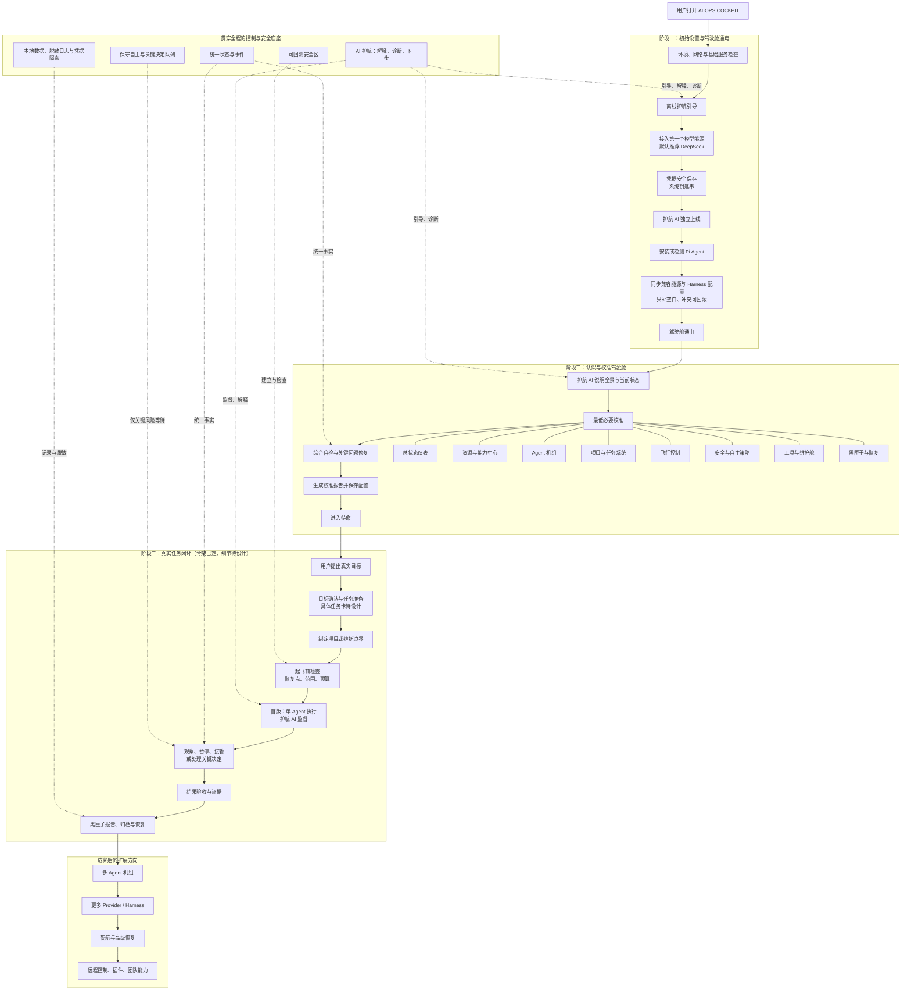
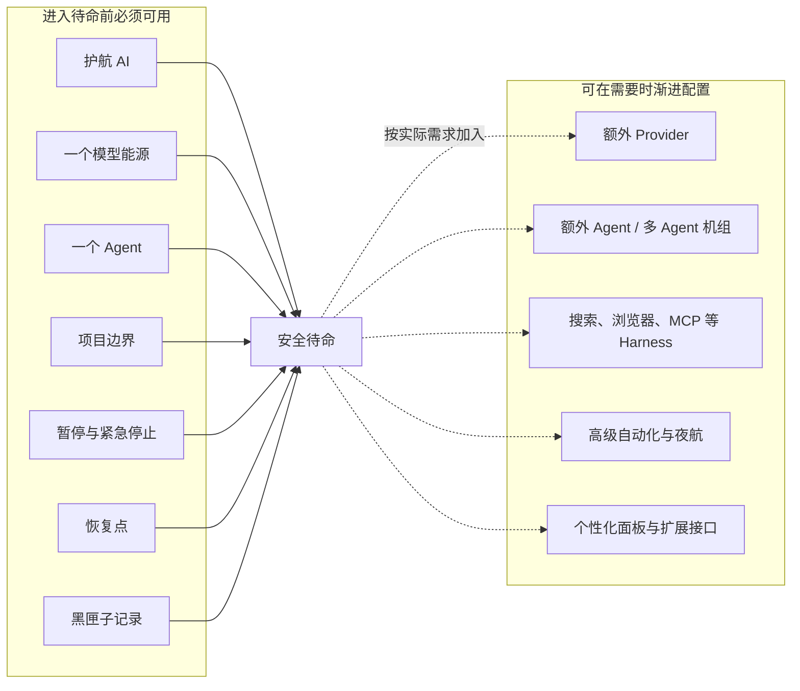
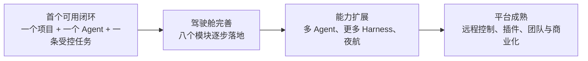

# AI·OPS COCKPIT · 完整产品流程图

> 本图把已经确认的产品大纲放到同一张主流程中，供整体阅读使用。它不是当前代码事实，也不替代产品总览。
> 标注“待设计”的节点不能直接作为开发要求；其中包括任务卡细节、点火、地面测试和第一次试飞。

## 1. 产品主流程

## 2. 最低必要校准与渐进能力

## 3. 首版与长期路线

## 4. 阅读规则

- 实线表示已确认的主路径或依赖。
- 虚线表示跨阶段的护航、状态、安全和记录能力。
- “阶段三”只确认任务闭环的骨架；不表示任务卡、点火、试飞和验收的交互细节已完成设计。
- 多 Agent、远程控制和插件生态属于演进方向，不应阻塞第一条可控任务闭环。
