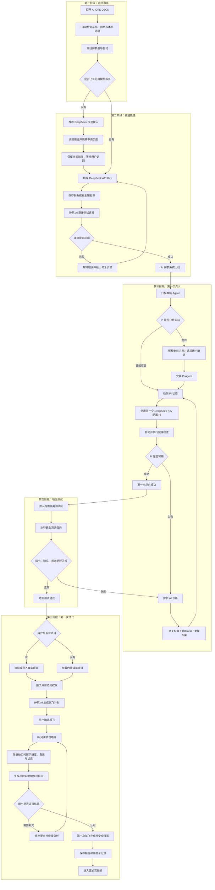

# AI·OPS DECK · 首次启动与第一次试飞流程 V1（历史备份）

> 状态：历史备份，不是当前方案
> 备份日期：2026-08-05
> 备份原因：保留讨论过程中形成的完整旧流程，供后续回顾和比较。
> 当前决定：第五阶段“第一次试飞”已经延后；现阶段先确定驾驶舱仪表盘及各模块。Pi 安装并可用，只代表驾驶舱具备正常通电条件。

## 当时采用的流程图

## 后续使用规则

- 本文件只用于保留历史推演，不作为开发或验收依据。
- 当前产品决策应更新到 `docs/PRODUCT.md` 后才成为事实源。
- 需要恢复旧思路时，可以从本图提取内容，但必须重新确认再写入当前方案。
