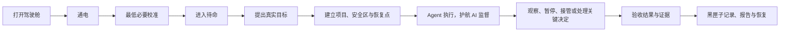
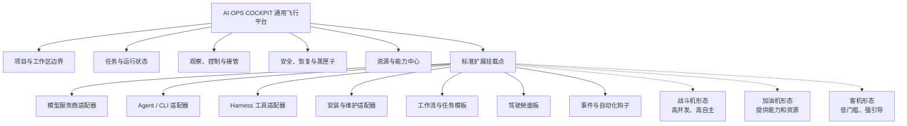
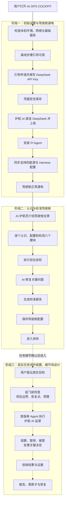
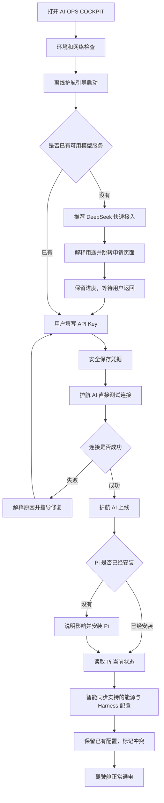
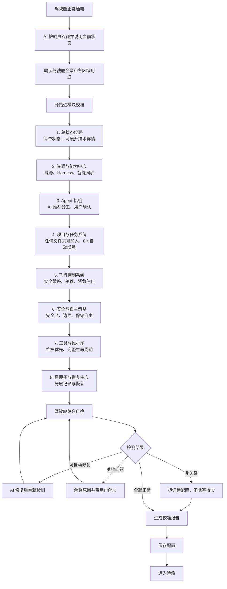
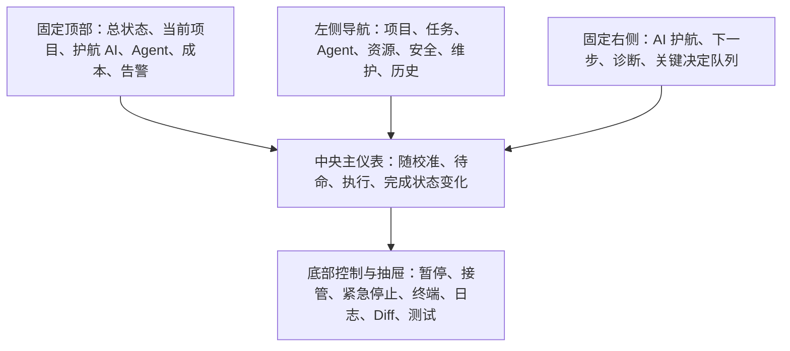
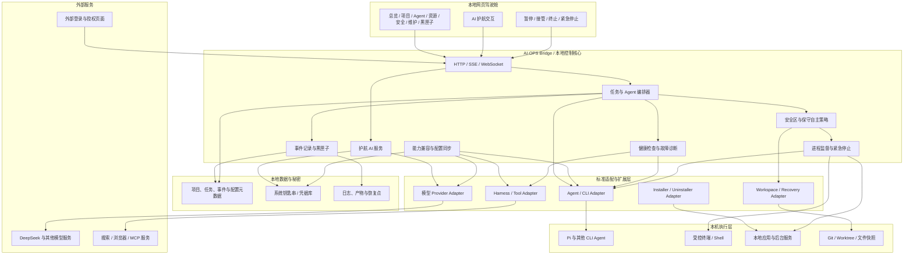

# AI·OPS COCKPIT · 产品流程与架构总览

> 本文件记录已经确认的产品大纲，不是当前实现事实源。
> 长期产品事实已经同步到 [PRODUCT.md](../PRODUCT.md)，当前版本与唯一切片以 [NOW.md](../NOW.md) 为准。
> 已延期的旧版“第一次试飞”流程保存在 [历史备份](../diagrams/archive/2026-08-05-first-start-and-first-flight-flow-v1.md)。

## 0. 阅读说明

- **已确认**：本轮对话中已经由用户明确选择或修正。
- **目标设计**：产品应达到的形态，不代表当前代码已经实现。
- **尚未决定**：需要后续继续讨论，不能直接作为开发要求。

当前已经详细讨论到：

```text
初始设置 → 驾驶舱通电 → 熟悉和校准仪表盘 → 进入待命
```

“点火、地面测试、第一次试飞、正式飞行”的详细定义暂时延后，但产品大纲必须先保留从待命到完成真实任务的完整生命周期，避免把“完成设置”误认为产品价值终点。

### 0.1 产品大纲



产品由五层共同组成：

1. **低门槛入口**：护航 AI 负责解释、配置、诊断和下一步引导。
2. **八个驾驶舱模块**：状态、资源、Agent、项目任务、飞控、安全、维护、黑匣子。
3. **任务运行闭环**：目标进入、执行准备、受控执行、验收与恢复；具体任务卡交互稍后单独设计。
4. **四项系统地基**：统一状态与事件、项目边界与恢复、适配器扩展、本地数据与凭据隔离。
5. **渐进发展路线**：首版先跑通单 Agent 受控任务，再扩展多 Agent、更多 Harness、远程控制和第三方生态。

---

## 1. 产品核心定义（已确认）

> **AI·OPS COCKPIT 是一个有 AI 指导护航的本地 AI Agent 运维驾驶舱。它把分散的 AI Agent、CLI、任务、项目和本地工具组织成一套可观察、可操作、可干预、可追溯的 AI 工作系统，让不懂模型、不懂 CLI、不懂配置的用户也能开始，同时不限制专业用户未来的能力上限。**

- 品牌名：**AI·OPS COCKPIT**
- 中文名：**AI 智能体驾驶舱**
- 完整定位：**有 AI 护航的本地 Agent 运维驾驶舱**

产品追求的是：

> **入口像消费级 AI 一样简单，能力上限像专业 Agent 系统一样高。**

它不是：

- AI 工具卡片的简单集合；
- 另一个 ChatGPT 或普通聊天壳；
- 以终端和配置文件为主要入口的专家工具；
- 一开始就实现所有插件和所有工作流的万能平台。

### 1.1 分阶段目标用户

- **初始用户**：会安装 App、会复制 API Key，已经感受到 AI 工具分散的痛苦，但不想学习 CLI、配置文件和多个工具的运维方式。
- **长期用户**：只会表达自己想完成什么，不理解模型、Agent、终端和配置，也能在 AI 护航下安全使用专业 Agent 能力。

初始版本选择较容易触达和验证的用户，不等于放弃“让普通人也能使用专业 Agent”的长期方向。

### 1.2 飞船隐喻

| 飞船概念 | 产品含义 |
|---|---|
| 驾驶员 | 用户 |
| 飞船 | 围绕用户目标组装起来的整套 AI 工作系统 |
| 驾驶舱 | AI·OPS COCKPIT |
| AI 护航员 | 始终理解当前状态、指导下一步并诊断问题的 AI |
| 飞行任务 | 用户想完成的目标或项目任务 |
| Agent 机组 | Pi、Codex、Claude、OpenCode 等执行 Agent |
| 能源 | DeepSeek 等模型服务与模型调用能力 |
| 雷达与外挂设备 | 搜索、浏览器、MCP、Git、终端、记忆等 Harness 能力 |
| 航电总线 | 能力兼容、配置同步与健康检查机制 |
| 飞行控制 | 启动、安全暂停、继续、接管、终止、紧急停止 |
| 安全区 | 项目边界、恢复点、隔离、费用限制与对外操作规则 |
| 黑匣子 | 任务过程、决定、变更、测试、成本、产物和恢复点 |

零散的 Agent 和工具只是飞船零部件；只有它们围绕目标形成可控、可恢复的运行系统，才构成“飞船”。

隐喻只用于帮助理解整体关系、状态和情绪。导航、按钮、错误和设置仍使用“项目、任务、暂停、恢复、费用”等直白名称，不要求用户学习一套航空词典。

---

## 2. 基础平台与扩展原则（已确认）

当前任务不是直接造一架固定用途的战斗机或客机，而是先完成一套通用飞行平台：



当前只预留和验证内部扩展边界，不急于发布第三方插件市场或稳定 SDK。接口应先经过多个真实适配器验证，再对外固定。

---

## 3. 产品总流程



### 3.1 当前阶段终点

当前终点不是“任务完成”，而是：

> **驾驶舱已经通电并完成校准，可以开始准备第一次任务；尚未点火、尚未起飞。**

这是当前详细设计的终点，不是产品价值的终点。进入代码开发前，必须另外定义一条能产生可检查交付物的真实任务闭环。只读扫描项目并生成体检报告可以作为首个验证候选，但不固定为所有用户唯一的第一次任务。

---

## 4. 驾驶舱通电流程

### 4.1 关键产品规则

- 用户只填写一次 DeepSeek API Key。
- 同一个 Key 默认供护航 AI 和 Pi 使用，但两条调用链独立。
- Pi 故障时，护航 AI 仍能直接使用 DeepSeek 帮助诊断。
- Key 只允许替换或删除，不展示完整内容。
- 目标存储位置为系统安全钥匙串，不进入项目、普通配置或日志。
- 外部跳转前解释原因；跳转后保留当前步骤；用户返回后自动重新检测。
- DeepSeek 是第一个推荐服务商，不是写死的唯一服务商。

### 4.2 通电流程图



Pi 安装并完成基础接入，只代表驾驶舱正常通电，不等于已经点火或完成试飞。

---

## 5. 驾驶舱熟悉与校准流程（已确认）

校准采用：

> **认识一个模块 → 立即配置 → 自动检测 → 再进入下一个模块。**

“认识八个模块”与“首日配完所有高级能力”不是一回事。校准采用两级范围：

- **最低必要校准**：护航 AI、一个模型能源、一个 Agent、项目边界、暂停与停止、恢复点、黑匣子必须可用，缺失时不能进入安全待命。
- **渐进校准**：额外 Provider、额外 Agent、搜索、浏览器、MCP、高级 Harness 和个性化设置可以标记为稍后配置，在实际需要时由护航 AI 继续引导。



### 5.1 进入待命的最低条件

- 护航 AI 正常工作；
- 至少一个模型能源可用；
- 至少一个 Agent 完成配置和健康检查；
- 项目边界机制可用；
- 安全暂停与紧急停止可用；
- 能建立恢复点；
- 黑匣子能够记录并恢复；
- 关键异常已经解决；
- 额外 Agent、搜索或高级 Harness 能力可以稍后增加。

---

## 6. 八个驾驶舱模块

### 6.1 总状态仪表

采用“分层混合型”：默认给新手显示结论、异常和下一步；展开后显示技术数据。

| 仪表       | 默认信息             | 快速操作    |
| -------- | ---------------- | ------- |
| 驾驶舱系统    | 已通电、待配置、异常       | 重新检测    |
| AI 护航员   | 在线、离线、响应异常       | 让 AI 诊断 |
| 能源系统     | DeepSeek 连接、预算与估算消耗 | 检测或更换   |
| Agent 机组 | Pi 与其他 Agent 的状态 | 配置或修复   |
| 项目系统     | 当前项目或未选择         | 选择项目    |
| 安全系统     | 安全区和恢复能力         | 自动补齐条件  |
| 工具与维护    | 正常与异常装备数量        | 扫描或修复   |
| 黑匣子      | 记录与恢复状态          | 检查存储    |

统一状态：绿色正常、黄色注意、红色故障、灰色未配置。

费用与用量在缺少可靠账单接口时必须标明“本地估算”，优先展示预算上限、估算消耗和是否接近限制，不用虚假的精确实时数字制造安全感。

### 6.2 资源与能力中心

由三部分组成：

1. 模型能源：DeepSeek 默认，高级区域允许增加其他服务商。
2. Harness 能力：搜索、浏览器、MCP、Git、终端、记忆等。
3. 航电总线：识别 Agent 支持能力并同步配置。

同步规则采用“智能同步”：

- 空白项自动补齐；
- 用户已有配置不覆盖；
- 冲突由 AI 护航员解释和处理；
- 能运行时注入就不复制秘密；
- 必须写配置文件时先备份、再合并、可回滚；
- 安装后逐项检测模型与 Harness 能力。

### 6.3 Agent 机组

分为：

- 当前机组：本次任务实际参与的主 Agent、辅助 Agent 和分工；
- Agent 机库：本机所有已知、已安装、待配置、可用或异常 Agent。

机组组建采用：

> **AI 根据任务推荐机组和分工，解释原因，用户确认后生效。**

Agent 状态：未安装、待配置、检测中、待命、工作中、等待关键决定、异常、已停用。

首个正式任务闭环采用“**单 Agent 执行 + 护航 AI 监督**”。多 Agent 机组仍是目标能力，现有群聊也继续保留，但不让多机组协调、冲突合并和成本翻倍阻塞首版闭环。

### 6.4 项目与任务系统

- 任何用户主动选择的文件夹都可以成为项目；
- 检测到 Git 后自动增加分支、Diff、恢复和提交能力；
- 默认不扫描整台电脑；
- 默认不访问项目目录以外的位置；
- 移除项目记录不能删除用户本地文件；
- 驾驶舱维护任务不算项目任务。

项目状态：未配置、检测中、待命、工作中、等待关键决定、异常、已停放。

### 6.5 飞行控制系统

控制分为三层：

- 整个任务：启动、安全暂停、继续、接管、终止；
- 单个 Agent：暂停分配、终止、替换、重试；
- 整个驾驶舱：紧急停止所有由 AI·OPS COCKPIT 启动的任务和子进程。

安全暂停不再分配下一步，并尽量允许当前步骤收尾；紧急停止用于失控保护。紧急停止不能误杀用户自己启动的无关进程。

### 6.6 安全与自主策略

安全不依赖用户看不懂的重复审批，而依赖“可回溯安全区”：

- 明确项目边界；
- 创建 Git 分支、Worktree 或文件快照；
- 保护用户已有未提交内容；
- 隔离凭据和敏感文件；
- 设置费用、时间和资源上限；
- 记录过程并支持回滚；
- 对外或不可恢复操作单独控制。

无人值守默认采用“保守自主”：

- 可恢复的项目内决定由 AI 自主完成；
- 有保守替代方案时创建检查点后继续；
- 局部分支阻塞时继续其他工作；
- 只有真正不可恢复的关键抉择才等待用户；
- 安全或成本失控时自动停止并保护现场。

关键抉择包括：改变产品目标、对外发布或发送、付款、不可恢复删除、使用敏感凭据、越过项目边界和无法回滚的系统操作。

安全区建立完成后，项目内可恢复操作默认自动执行，不提供“每一步都询问”的伪安全模式。用户可以设置按动作类型生效的常设规则，例如“项目内可恢复修改自动执行”“对外发布永远询问”。

关键决定进入决定队列，每张决定卡至少解释：当前上下文、AI 想做什么、原因、影响、不处理的后果、可选替代方案和推荐选择。等待决定时，只挂起相关分支，其他安全工作继续进行。

本模块只拥有“什么动作允许执行、在什么边界内自主执行”的规则。原始日志、文件变化、恢复点、历史浏览和实际恢复操作统一归属“黑匣子与恢复中心”，避免安全规则与审计记录重复建设。

### 6.7 工具与维护舱

当前工具控制台转为“维护总览 + 装备库”：

- 首页优先展示哪些设备正常、哪些需要处理；
- 完整工具目录放在二级页面；
- 支持发现、安装、配置、检测、启动、更新、修复、停用和卸载；
- 安装后进入资源与能力中心进行智能配置同步；
- 不支持的能力显示“不支持”，不误报为故障。

卸载分为：

- 停用：保留程序；
- 默认卸载：卸载程序并保留配置；
- 彻底清理：单独列出删除内容后执行。

卸载不得删除用户项目、共享 API Key、其他 Agent 仍使用的 Harness 配置，或终止无关进程。

### 6.8 黑匣子与恢复中心

记录：任务目标、基线、Agent 机组、AI 自主决定、执行步骤、命令、错误、重试、文件变化、Git Diff、测试、产物、时间、费用、待决定事项和对外操作。

保存策略采用分层模式：

- 结构化时间线、变更和恢复点长期保留；
- 原始技术日志限量保存并自动清理；
- 重要产物由用户决定长期归档；
- Token、API Key 和敏感字段在写入前脱敏；
- 支持保留全部、恢复单个文件、回滚任务和局部重做；
- 外部操作只能记录，不能伪装成可撤销。

---

## 7. 驾驶舱界面骨架（概念结构）

驾驶舱采用“固定外框 + 状态驱动中央主仪表区”：



原则：

- 新手主要看中央主仪表与 AI 护航；
- 高级用户展开终端、日志、Git 和详细配置；
- 总状态、告警和紧急停止始终可见；
- 仪表盘只显示摘要、风险和常用操作，详细配置进入模块页或抽屉。
- 右侧护航区一次只突出一个“现在最该做什么”，其余事项折叠进队列；
- 待命页不能是空白管理后台，应保留清晰的任务入口和少量情境建议，具体任务卡交互稍后设计；
- 隐喻用于整体关系与状态，功能标签和操作按钮保持直白。

---

## 8. 信息架构（目标草案）

```mermaid
flowchart TB
    APP["AI·OPS COCKPIT"]

    APP --> DASH["驾驶舱总览"]
    APP --> PROJ["项目中心"]
    APP --> AGENT["Agent 机组"]
    APP --> CAP["资源与能力中心"]
    APP --> SAFE["安全与自主中心"]
    APP --> MAINT["工具与维护舱"]
    APP --> BOX["黑匣子与历史"]

    DASH --> STATUS["总状态仪表"]
    DASH --> MAIN["状态驱动主仪表"]
    DASH --> GUIDE["AI 护航员"]
    DASH --> CTRL["全局飞行控制"]

    PROJ --> PLIST["项目列表 / 最近项目 / 已停放项目"]
    PROJ --> PDETAIL["项目驾驶舱"]
    PDETAIL --> TASKS["任务与运行记录"]
    PDETAIL --> FILES["工作区、Git 与文件变化"]
    PDETAIL --> PSET["项目边界与默认规则"]

    AGENT --> CREW["当前机组"]
    AGENT --> HANGAR["Agent 机库"]
    AGENT --> ADETAIL["能力、状态、版本与日志"]

    CAP --> ENERGY["模型能源与预算"]
    CAP --> HARNESS["搜索、浏览器、MCP 等 Harness 能力"]
    CAP --> SYNC["兼容表、智能同步与冲突处理"]

    SAFE --> RECOVER["安全区与恢复点"]
    SAFE --> NIGHT["夜航计划与保守自主规则"]
    SAFE --> DECISION["关键决定队列"]
    SAFE --> LIMIT["时间、费用、范围与对外操作边界"]

    MAINT --> OVERVIEW["维护总览"]
    MAINT --> EQUIP["装备库"]
    MAINT --> LIFE["安装、更新、修复、停用、卸载"]
    MAINT --> PROC["进程、服务与终端"]

    BOX --> TIMELINE["任务时间线"]
    BOX --> CHANGES["文件、Git、测试与产物"]
    BOX --> RESTORE["对比与恢复"]
    BOX --> REPORT["夜航报告与导出"]
```



### 8.1 现有页面的迁移归属

| 当前能力 | 新体系归属 |
|---|---|
| 工具控制台首页 | 工具与维护舱 → 装备库 |
| 快捷安装 | 工具与维护舱 → 生命周期管理 |
| 多 Agent 群聊 | Agent 机组 + 未来任务执行区 |
| 全屏终端 | 工具与维护舱 + 人工接管入口 |
| 后台进程 | 飞行控制 + 维护总览 |
| Agent Catalog / Caller | Agent 适配层的现有地基 |
| 工具扫描与服务探活 | 维护舱健康检测的现有地基 |

### 8.2 统一状态与事件基础

状态驱动不是只给界面换颜色，而是让界面、护航 AI、编排器、飞控和黑匣子读取同一份事实。第一版至少统一以下实体：

| 实体 | 需要统一表达的核心状态 |
|---|---|
| 驾驶舱 | 未通电、校准中、待命、运行中、受限、异常 |
| 模型能源 / Harness | 未配置、检测中、可用、受限、异常、已停用 |
| Agent | 未安装、待配置、待命、工作中、等待决定、异常、已停用 |
| 项目 | 未配置、待命、工作中、等待决定、异常、已停放 |
| 任务 / 执行批次 | 草稿、准备中、运行中、暂停、等待决定、失败、完成、已终止 |
| 安全区 / 恢复点 | 未建立、建立中、可用、失效、恢复中、已恢复 |

精确枚举和迁移条件在正式任务设计时确认，避免现在构造万能状态机。所有迁移都必须产生结构化事件，至少包含实体、前后状态、原因、来源、时间和关联任务；UI、护航 AI、错误处理与黑匣子不得各自维护一套互相矛盾的状态。

### 8.3 八模块所有权边界

模块按“唯一事实归属”划分，而不是按页面外观划分。一个能力可以被多个页面调用，但只能由一个模块拥有其最终状态与规则。

| 模块 | 唯一拥有 | 不拥有 |
|---|---|---|
| 总状态仪表 | 聚合状态、告警、预算和唯一下一步 | 配置、执行、长期历史 |
| 资源与能力中心 | Provider、凭据、Harness 能力与兼容配置 | 安装卸载、任务执行、进程控制 |
| Agent 机组 | Agent 目录、能力、角色、当前机组和对话入口 | 项目任务状态、最终产物 |
| 项目与任务系统 | 项目边界、任务目标、执行批次和验收定义 | 操作系统进程控制 |
| 飞行控制 | 启动、暂停、继续、接管、终止和进程监督 | 安全政策、长期审计历史 |
| 安全与自主策略 | 安全区、限制、保守自主、常设规则和关键决定 | 原始日志、历史浏览、恢复操作 |
| 工具与维护舱 | 发现、安装、健康检查、更新、修复、停用和卸载 | Agent 分工、项目目标 |
| 黑匣子与恢复 | 事件、日志、Diff、检查点、报告和恢复 | 判断动作是否允许 |

AI 护航是贯穿八个模块的解释、诊断和引导能力，不单独形成第九模块；统一状态与事件是公共地基，不由任何页面私有。详细决定见 [ADR-001](../decisions/ADR-001-cockpit-module-boundaries.md)。

---

## 9. 目标运行架构（草案）

当前 Express / WebSocket / SSE / node-pty 服务可演进为本地 **AI·OPS Bridge / 控制核心**，不需要为了架构图直接重写技术栈。



### 9.1 控制面与执行面分离

- 护航 AI 属于控制面，直接通过模型服务商适配器工作。
- Pi 等 Agent 属于执行面；它们损坏时不能带着护航 AI 一起失效。
- 所有执行动作先经过项目边界、安全区和恢复策略。
- 所有运行事件进入黑匣子，凭据不进入普通日志。
- 首版执行面只要求一个 Agent 跑通完整任务，控制面负责状态解释、安全策略、暂停接管和结果验收；多 Agent 编排后续再叠加。

### 9.2 数据策略方向

| 数据 | 目标位置 | 说明 |
|---|---|---|
| API Key 与秘密 | macOS Keychain 等系统凭据库 | 不进入项目、普通数据库和日志 |
| 项目、任务、事件元数据 | 本地持久化存储 | 当前产品路线建议 SQLite，但尚未最终立项 |
| 文件变化与恢复点 | Git / Worktree / 文件快照 | 按项目能力选择 |
| 原始技术日志 | 本地限量存储 | 自动脱敏和清理 |
| 重要报告与产物 | 本地归档 | 用户决定长期保留 |

---

## 10. 关键失败模式与产品行为

错误不能只显示技术日志。所有面向用户的错误至少回答：发生了什么、可能原因、造成什么影响、AI 已自动做了什么、用户现在最建议做什么，以及能否恢复或继续。

| 失败 | 产品不能怎么做 | 正确行为 |
|---|---|---|
| DeepSeek 不可用 | 把 Pi 和护航 AI 一起显示为神秘故障 | 离线引导解释原因，修复或切换服务商 |
| Pi 安装但不可用 | 只显示“已安装” | 显示待配置或异常，并逐项检测能源与 Harness |
| 配置冲突 | 自动覆盖用户文件 | 备份并保留原配置，由 AI 解释差异 |
| 夜航遇到非关键问题 | 停住整个任务等待用户 | 采用保守方案或挂起局部分支，继续其他工作 |
| 任务修改失败 | 留下半成品且无法解释 | 停止相关步骤，保留现场并提供恢复点 |
| 对外操作不可恢复 | 声称 Git 可以回滚 | 起飞前设定规则，运行中隔离或阻止 |
| 进程失控 | 杀死电脑上所有同名进程 | 只终止驾驶舱创建并记录的子进程 |
| 黑匣子不可写 | 继续全自动运行 | 禁止进入无人值守自动驾驶，先修复记录能力 |
| 卸载来源未知 | 猜测一条卸载命令 | 说明无法确认，使用官方步骤或人工处理 |

---

## 11. 已确认与本轮吸纳的产品原则

1. 产品核心是有 AI 指导护航的 AI Agent 运维驾驶舱。
2. 项目优先，工具控制台作为辅助维护能力。
3. 当前先完成通用飞行平台，不绑定单一用途。
4. DeepSeek 作为第一个推荐能源，保留多服务商扩展入口。
5. 一个 DeepSeek Key 默认同时供护航 AI 和 Pi 使用，但调用链独立。
6. 新 Agent 自动获取兼容的能源与 Harness 配置。
7. 智能同步只填空白项，不覆盖用户已有配置。
8. Agent 机组由 AI 推荐，用户确认后生效。
9. 任何文件夹可成为项目，Git 项目自动增强。
10. 飞控同时提供安全暂停与紧急停止。
11. 自动驾驶建立在可回溯安全区上，不建立在重复权限弹窗上。
12. 无人值守默认保守自主，非关键问题不能阻塞整夜工作。
13. 工具与维护舱以维护状态为首页，装备目录为二级页面。
14. 默认卸载程序并保留配置，彻底清理单独执行。
15. 黑匣子采用结构化记录长期保留、原始日志限量清理的分层策略。
16. 初始用户以能安装 App 和复制 Key、但不想维护 CLI 的人群为主；长期仍服务不懂技术的普通用户。
17. 八个模块都需要被认识，但只强制完成最低必要校准，高级能力渐进配置。
18. 驾驶舱、资源、Agent、项目、任务和安全区共用统一状态与事件基础。
19. 首个正式任务采用单 Agent 执行、护航 AI 监督，多 Agent 作为后续增强。
20. 隐喻用于整体关系和状态，功能标签、错误与操作保持直白。
21. 关键决定采用结构化决定卡和常设规则，不采用每一步都询问的伪安全模式。
22. 费用优先显示预算与估算消耗，无法精确时必须明确标注估算。
23. 右侧护航区一次突出一个下一步，待命页提供明确任务入口而不是空白面板。
24. 八个模块保留，但每类事实只有一个所有者；跨模块只引用，不复制状态和规则。
25. 当前唯一版本目标是“第一次可控任务”：一个 Git 项目、一个 Pi Agent、一条可观察、可暂停、可验证、可恢复的真实任务。

---

## 12. 尚未决定

以下内容不能直接进入开发：

1. “点火”的准确产品定义和验收条件；
2. 地面测试的具体内容；
3. 第一次试飞的流程和结果；
4. 日常任务如何创建、拆解和验收；任务卡具体字段、确认和计划交互暂缓讨论；
5. 第一条真实任务闭环内部各切片的技术方案与可执行验收命令；
6. 统一状态的精确枚举、迁移条件和事件协议；
7. Git 分支、Worktree 和恢复点的具体实现组合；
8. 本地持久化数据库和日志保留时长的最终方案；
9. 驾驶舱具体视觉布局、尺寸和交互样式；
10. DeepSeek 与 Pi 以外的 Provider、Agent 和 Harness 何时进入正式版本；
11. 插件接口何时对第三方开放；
12. 远程网页控制、移动端和 AI·OPS Bridge 分发方式。

---

## 13. 产品大纲阅读顺序

建议按以下顺序阅读：

1. 第 0–2 节：产品定位、目标用户、整体大纲和扩展边界；
2. 第 3–5 节：通电、必要校准、待命与未来任务闭环的关系；
3. 第 6 节：八个模块是否完整且没有越界扩张；
4. 第 7–8 节：驾驶舱骨架、信息架构与统一状态基础；
5. 第 9–10 节：运行架构与失败处理是否符合“可控、可恢复”；
6. 第 11–12 节：吸纳的原则和下一轮真正需要决定的问题。

---

## 14. 从现有产品到目标驾驶舱的迁移轮廓

这不是逐项开发计划；它说明已经确认的重构方向，具体 active 版本和唯一切片以 `NOW.md` 为准：

1. **控制地基**：护航 AI 独立上线，凭据安全保存，建立最小状态与事件通道。
2. **通电与校准**：DeepSeek、Pi、智能配置同步和最低必要健康检查形成闭环。
3. **第一条可控任务**：一个项目、一个 Agent、一个任务，具备边界、恢复点、状态、暂停、验收证据和黑匣子。
4. **扩展八个模块**：逐步补齐多 Agent、更多 Harness、维护生命周期、夜航和高级恢复。
5. **成熟后再扩展**：第三方插件、远程网页控制、移动端、团队协作和商业化。

产品大纲与第一版本唯一目标已经确认。第一个切片仍需补齐技术方案、修改范围、验证命令和关键决策，达到 Definition of Ready 后才创建产品代码工作分支。
