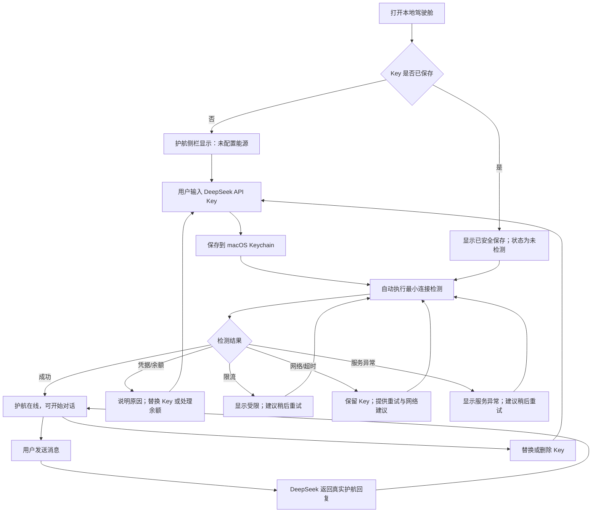
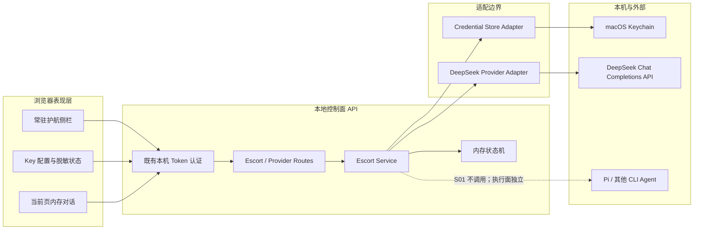

# S01 · 护航 AI 独立上线设计

> 本文已由用户在 2026-08-06 授权继续工作时确认。结论已回写 [NOW.md](../NOW.md)，[ADR-002](../decisions/ADR-002-provider-control-plane-and-keychain.md) 已接受；实现必须另按 `writing-plans` 生成的逐步计划执行。

## 1. 这次要交付什么

用户打开本地 AI·OPS COCKPIT 后，可以在主界面的护航侧栏中：

1. 输入自己的 DeepSeek API Key；
2. 让系统安全保存并检测连接；
3. 看懂连接成功或失败的具体原因；
4. 与护航 AI 完成一次真实对话；
5. 替换或删除 Key；
6. 即使 Pi 没安装、没登录或不能运行，以上能力仍不受影响。

可观察起点是“未配置能源，护航离线”；可观察终点是“DeepSeek 可用，护航在线，用户收到真实回复”。

S01 不是完整的驾驶舱通电：它只接通第一路模型能源和护航控制面。Pi 安装、配置同步与“驾驶舱通电”仍属于后续切片。

## 2. 已确认约束

- 产品是有 AI 指导护航的本地 Agent 运维驾驶舱，不是 AI 工具箱。
- DeepSeek 是第一个推荐 Provider，不是永远唯一的 Provider。
- 一个 DeepSeek Key 未来默认可供护航 AI 和 Pi 使用，但两条调用链必须独立；S01 不配置 Pi。
- 凭据属于“资源与能力中心”，护航 AI 是跨模块能力；不能把 Key 交给旧群聊或 Agent 目录保存。
- 用户只在关键风险上做决定；普通配置步骤由产品完成并留下可检查状态。
- 当前是 macOS 本地网页应用，只监听本机；不做远程、多用户和跨平台。
- 当前工作区的 `.gitignore`、`AGENTS.md` 和 `docs/` 未提交内容均为用户资产，不能覆盖或丢弃。

## 3. 方案比较

| 方案 | 做法 | 优点 | 主要问题 | 结论 |
|---|---|---|---|---|
| A. 塞进现有群聊 | 在 `/api/chat` 和 `public/js/chat.js` 中增加 DeepSeek 直连目标 | 表面文件少、入口现成 | 护航与 CLI 执行面继续耦合；大文件回归风险高；Pi 故障边界不清 | 不采用 |
| B. 独立控制面 + 常驻护航侧栏 | 新建 Keychain、Provider、Escort Service 和独立前端组件，挂到现有主页面 | 满足独立护航；边界可测试；用户始终能看到状态和下一步 | 新增少量文件，需要定义稳定接口 | **推荐** |
| C. 先做完整多 Provider 平台 | 先实现 Provider 注册、Schema、插件和多 Provider 设置页 | 长期扩展最完整 | 远超 S01；增加迁移、选择和 UI 复杂度，延迟真实闭环 | 暂不采用 |

推荐 B。它刻意只实现一个 DeepSeek Adapter，但保留 `Provider → Escort Service → HTTP/UI` 的稳定依赖方向。未来增加 Provider 是增加适配器和选择规则，不是重写护航 AI。

## 4. 用户流程与界面状态



### 4.1 主界面形态

在现有 `/` 主页面右侧新增常驻护航栏，不新造第二套产品首页：

- 顶部：`护航 AI`、能源状态灯、一个直白状态词；
- 主卡：当前唯一下一步，例如“接入 DeepSeek”“重新检测”“开始提问”；
- 配置态：密码输入框、`保存并检测`，以及申请 Key 的官方链接；
- 在线态：简洁对话区和输入框；
- 设置折叠区：`检查连接`、`替换 Key`、`删除 Key`；
- 错误卡：发生了什么、影响、建议动作、是否可重试。

不展示完整 Key，也不展示末四位。只显示固定的 `••••••••（已安全保存）`，避免为了“脱敏显示”而把秘密重新传到浏览器。

### 4.2 浏览器数据规则

- Key 输入使用 `type="password"`、`autocomplete="new-password"`、关闭拼写检查；提交后立即清空。
- Key、回复与对话历史不写 localStorage、sessionStorage 或 IndexedDB。
- S01 对话历史只保存在当前页面内存，最多 12 条；刷新即清空。
- 回复按纯文本渲染，不用 `innerHTML`，避免模型输出成为 XSS 入口。
- 删除 Key 是明确的敏感操作，需要一次就地确认；不再追加多层弹窗。

## 5. 运行架构



### 5.1 依赖规则

- 路由只做认证后的输入校验和 HTTP 映射，不直接调用 Keychain 或拼 DeepSeek 请求。
- Escort Service 负责编排凭据、Provider 和状态，不依赖 CLI Agent、终端或安装器。
- DeepSeek Adapter 只认识标准消息、Provider 请求和 Provider 错误，不认识页面 DOM。
- Credential Store 只认识固定 service/account 和增删改查，不认识 DeepSeek 请求。
- 旧 `/api/chat` 与 `src/agent-caller.js` 不修改，作为回归保护边界。

## 6. 凭据设计

### 6.1 固定标识

- Keychain service：`com.ai-ops.cockpit.provider.deepseek`
- account：`default`
- label：`AI·OPS COCKPIT · DeepSeek`

以上值由代码固定，不接受浏览器输入，避免参数注入和产生无法追踪的条目。

### 6.2 Keychain 操作

| 操作 | 系统调用原则 | 秘密流向 |
|---|---|---|
| 保存/替换 | `/usr/bin/security add-generic-password` + `-U`；`-w` 必须是最后一个参数 | 通过受控 PTY 等待固定提示后输入；Key 不进入 argv、环境变量、文件、日志或返回值 |
| 读取 | `/usr/bin/security find-generic-password ... -w` | stdout 只返回服务端内存，不写日志、不返回前端 |
| 删除 | `/usr/bin/security delete-generic-password ...` | 无秘密参数；不存在时按幂等成功处理 |
| 状态 | 尝试查找并只返回是否存在 | 前端仅得到 `configured: true/false` |

本机 `/usr/bin/security help add-generic-password` 已确认：使用 `-w` 直接携带密码不安全，应把 `-w` 放在最后通过提示输入。首次真实网页验收进一步确认该提示读取控制终端而非普通 stdin；实现因此复用既有 `node-pty`，强制 C locale、只识别固定提示、写入后不保留 PTY 输出，并保留 10 秒超时与强制回收。

### 6.3 输入边界

- 只接受字符串；去除首尾换行和空格后长度 16–512；拒绝内部空白和控制字符。
- 不强制 Key 必须以某个前缀开头，避免 Provider 调整格式后把合法 Key 拒之门外。
- 任何 Keychain 原始 stderr、stdout 或子进程异常都不原样返回；统一映射为安全错误码。
- Keychain 不可用时绝不回退到 `.env`、JSON、明文文件或浏览器存储。

## 7. Provider 与护航对话设计

### 7.1 DeepSeek 默认配置

- Base URL：`https://api.deepseek.com`
- Endpoint：`POST /chat/completions`
- 默认模型：`deepseek-v4-flash`
- S01：关闭 thinking，优先快速、低成本的配置与诊断体验；模型名和请求选项集中在 Adapter 常量中。
- 连接检测：发送一个最小非流式请求，要求只回复 `OK`，限制少量输出；成功后才标记 `available`。
- 正式护航对话：S01 使用非流式响应、30 秒客户端超时和有限输出；不引入工具调用。

选择非流式是 S01 的刻意约束：当前切片优先验证凭据、独立调用链、错误归类和真实回复。流式解析、停止与断线续接在后续体验切片设计，不混入高风险凭据地基。

DeepSeek 当前官方文档给出的 OpenAI 兼容 Base URL 是 `https://api.deepseek.com`，当前模型为 `deepseek-v4-flash` / `deepseek-v4-pro`；错误码包括 401、402、429、500 和 503。实现时以官方文档为协议依据：

- [Chat Completion](https://api-docs.deepseek.com/api/create-chat-completion)
- [错误码](https://api-docs.deepseek.com/zh-cn/quick_start/error_codes/)
- [模型与定价](https://api-docs.deepseek.com/quick_start/pricing)
- [多轮对话](https://api-docs.deepseek.com/guides/multi_round_chat)

### 7.2 护航身份边界

系统提示词只承担：

- 用普通语言解释当前连接/配置问题；
- 根据用户问题给出下一步；
- 明确哪些事情尚未执行；
- 在 Pi 不可用时提供诊断思路。

系统提示词必须明确：S01 没有工具调用权，不能声称已经安装、修改、检测本机文件或执行命令。用户输入也不能改变这条能力事实。

### 7.3 请求约束

- 用户消息：1–8,000 字符；
- 历史：最多 12 条，总量上限 30,000 字符，只接受 `user` / `assistant` 纯文本；
- 输出：S01 采用保守上限，避免一次误操作产生大额消耗；
- 并发：本地护航请求最多 1 个在途；额外请求返回可重试的 `busy`；
- 频率：路由级限流低于现有全局 200 次/分钟，避免本地页面循环导致费用失控；
- 超时后立即中止上游请求并把状态标为可重试异常。

## 8. 状态与错误模型

### 8.1 Provider 状态

| 状态 | 含义 | 进入条件 | 用户主动作 |
|---|---|---|---|
| `unconfigured` | 没有保存 Key | Keychain 无条目或已删除 | 接入 DeepSeek |
| `unchecked` | Key 已保存，当前进程尚未验证 | 启动后发现 Key；替换后检测前 | 检查连接 |
| `checking` | 正在进行真实检测 | 用户保存/重试 | 等待，不重复提交 |
| `available` | 最近一次真实请求成功 | 检测或聊天成功 | 开始/继续对话 |
| `limited` | 凭据存在，但余额或限流阻止调用 | 402 或 429 | 充值或稍后重试 |
| `unavailable` | 凭据、网络、超时、服务或响应异常 | 失败映射 | 按错误建议修复 |

状态和 `lastCheckedAt` 只保存在内存。重启后有 Key 即回到 `unchecked`，不会拿过期的“在线”状态欺骗用户。

### 8.2 稳定错误码

| code | 来源 | 页面解释 | retryable |
|---|---|---|---|
| `credential_missing` | 无 Key | 尚未接入 DeepSeek | false |
| `credential_invalid` | HTTP 401 | Key 无效或已失效 | false |
| `insufficient_balance` | HTTP 402 | 余额不足 | false |
| `rate_limited` | HTTP 429 | 当前请求受限 | true |
| `provider_request_invalid` | HTTP 400/422 | 驾驶舱请求与 Provider 协议不兼容 | false，需修复代码 |
| `provider_unavailable` | HTTP 500/503/其他 5xx | DeepSeek 暂时异常或繁忙 | true |
| `network_error` | DNS、连接、TLS 等 | 本机无法连接服务 | true |
| `timeout` | 超过 30 秒 | 请求未及时完成 | true |
| `invalid_response` | 2xx 但缺少合法回复 | 服务响应无法识别 | true |
| `credential_store_unavailable` | Keychain 失败/非 macOS | 无法安全保存或读取凭据 | 视原因 |
| `busy` | 已有请求在途 | 护航正在处理上一条消息 | true |

上游原始错误正文只允许在内存中用于受控分类，不进入日志或浏览器。面向用户的每个错误固定回答：发生了什么、影响、建议动作、是否可以重试。

### 8.3 本地 HTTP 约定

本地认证失败保留 HTTP `401`。Provider 的 401 不能直接透传，否则现有 `OPS.api` 会误判为驾驶舱 token 失效：

- 状态/检测接口始终返回安全的结构化结果；
- 输入错误用 `400`；
- 未配置或业务状态冲突用 `409`；
- 外部依赖失败用 `424` / `502`；
- 超时用 `504`；
- 响应体统一包含稳定 `code`，UI 不依赖原始 HTTP 文案。

## 9. 本地 API 契约

所有接口沿用现有 `/api` token 闸门；只有 `/api/health` 继续匿名，凭据和护航接口绝不加入白名单。

| Method | Path | 请求 | 安全响应 |
|---|---|---|---|
| GET | `/api/providers/deepseek/status` | 无 | `configured`、`display`、`availability`、`lastCheckedAt`、安全错误 |
| PUT | `/api/providers/deepseek/credential` | `{ apiKey }` | 保存结果；不回显 Key；随后 UI 自动检测 |
| DELETE | `/api/providers/deepseek/credential` | 无 | 幂等删除结果与 `unconfigured` 状态 |
| POST | `/api/providers/deepseek/check` | 无 | 检测后的结构化 Provider 状态 |
| POST | `/api/escort/messages` | `{ message, history }` | 护航纯文本回复、模型标识、Provider 状态；无 reasoning 原文 |

API 不返回 Key、Key 长度、前后缀、Keychain 路径、DeepSeek 原始错误体或堆栈。

## 10. 精确修改范围

### 10.1 计划新增

| 路径 | 职责 |
|---|---|
| `src/providers/deepseek.js` | DeepSeek 请求、超时、响应解析与错误归类 |
| `src/services/credential-store.js` | macOS Keychain 固定条目的安全增删改查 |
| `src/services/escort-service.js` | 状态、检测、聊天、并发和服务编排 |
| `src/routes/escort.js` | Provider / Escort HTTP 契约与输入验证 |
| `public/js/escort.js` | 护航侧栏状态、配置和对话交互 |
| `public/css/escort.css` | 护航侧栏及响应式样式 |
| `test/credential-store.test.js` | Keychain 普通命令、受控 PTY 提示、秘密不进 argv/环境/输出及真实无写入提示探针 |
| `test/deepseek-provider.test.js` | 成功响应、HTTP/网络/超时/非法响应映射 |
| `test/escort-service.test.js` | 状态迁移、Pi 独立、并发与历史边界 |
| `test/escort-routes.test.js` | HTTP 契约、状态字段白名单、限流与安全错误响应 |

### 10.2 计划修改

| 路径 | 只允许的变化 |
|---|---|
| `package.json` | 增加 `node --test` 测试脚本；不新增依赖 |
| `src/server.js` | 装配 Escort Service 与新路由；不改变监听、认证、旧路由和终端行为 |
| `public/index.html` | 引入护航侧栏 DOM、CSS、JS；不删除现有控制台/安装/群聊入口 |
| `docs/NOW.md` | 状态、证据、交接和 Done 判断 |
| `docs/CODEMAP.md` | 仅在代码入口实际改变后更新 |
| 本设计与 ADR-002 | 记录获批决策和实现偏差 |

### 10.3 禁止修改

- `src/agent-caller.js`、`src/routes/api.js`、`public/js/chat.js`：旧 CLI 群聊边界；
- `src/terminal.js`、安装/启动路由：S01 不涉及高权限执行；
- `agents.config.json`、`tools.json`、`.token`：不把 Provider Key 混入既有本地配置；
- `public/vendor/`、`package-lock.json`：本切片不升级依赖；
- 用户已有未知代码或配置改动。

任何超出范围的必要变化先停下，回写设计并取得用户确认。

## 11. 两个专注工作段

### 工作段一：安全控制面

1. 建立 Node 原生测试入口；
2. 实现 Credential Store 与测试；
3. 实现 DeepSeek Adapter、错误模型与测试；
4. 实现 Escort Service、状态机与测试；
5. 接入路由并完成无真实 Key 的自动化验证。

退出条件：所有测试通过；假的 Key 不出现在 argv/日志；Provider 错误映射可重复；旧 CLI 代码未修改。

### 工作段二：网页闭环与真实验收

1. 加入常驻护航侧栏和响应式样式；
2. 接通保存/检测/替换/删除/聊天 UI；
3. 完成语法、隔离端口健康检查和回归检查；
4. 用户只在网页中使用自己的 Key 做真实验收；
5. 回写需求—证据映射、残余风险和交接。

退出条件：六条 S01 验收标准都有证据；Key 不交给 AI；Pi 不可用时仍能对话。若真实验收未完成，只能标为“代码完成、验收待用户”，不能把切片改为 done。

## 12. 验证方案

### 12.1 自动证据

```bash
npm test
node --check src/providers/deepseek.js
node --check src/services/credential-store.js
node --check src/services/escort-service.js
node --check src/routes/escort.js
node --check public/js/escort.js
git diff --check
node /Users/bz01/.agents/skills/solo-dev-loop/scripts/validate-project-state.mjs . --strict
```

服务装配使用未占用的隔离端口，不处理当前占用 `3210` 的未知进程：

```bash
PORT=43211 npm start
curl http://127.0.0.1:43211/api/health
```

启动服务会生成 `.token`，但验证人员不得读取、打印或提交它。凭据接口的自动集成通过服务/路由测试完成，真实路径通过浏览器页面完成。

### 12.2 人工验收

1. 页面初始显示“未配置”，没有伪在线状态；
2. 在网页中输入真实 Key，保存后输入框清空，页面只显示固定脱敏占位；
3. 检测成功后状态变为“护航在线”，发送一句话并收到真实回复；
4. 用无效 Key 替换，看到“凭据无效”而不是“本地 token 失效”；再恢复有效 Key；
5. 断网或制造超时条件时保留 Key，并显示可重试的网络/超时说明；
6. 删除 Key 后状态回到 `unconfigured`，刷新后仍未配置；
7. 用 Keychain Access（图形界面）确认固定条目增改删，不复制或展示其内容；
8. Pi 不可用时重复第 3 步，护航仍然成功；
9. 检查 Git 状态与应用日志，没有新增凭据文件或 Key 内容。

402、429、500、503 等难以稳定人工制造的分支以自动化映射测试为主；若真实运行遇到，补充为实际证据。

## 13. 安全审查清单

- [x] Key 只从受现有 token 保护的本机 loopback HTTP 请求体进入本地进程，并只在固定 Keychain 提示出现后进入受控 PTY；
- [x] Key 不在 argv、URL、响应、日志、异常、DOM 文本和浏览器持久化中；
- [x] Provider 原始错误不透传，401 不与本地认证混淆；
- [x] 所有新接口都经过现有 token 闸门和本机监听边界；
- [x] 用户/模型文本用纯文本渲染；
- [x] 输入、历史、输出、并发、频率和超时有硬限制；
- [x] 删除幂等，替换不会产生多个散落的 Keychain 条目；
- [x] Keychain 失败时不会降级明文保存；
- [x] 护航 AI 不声称执行了 S01 没有的工具动作；
- [x] 测试、截图、报告和交接不包含真实 Key。

以上勾选表示代码、自动化测试和无真实 Key 的页面审查已提供证据，不表示真实 Keychain / DeepSeek 链路已经验收。真实外部链路仍按 §12.2 由用户完成。

## 14. 非功能目标与残余风险

| 类别 | S01 目标 | 残余风险 |
|---|---|---|
| 安全 | 系统钥匙串、秘密隔离、输入与费用边界 | 本机 loopback HTTP 不提供传输加密；同一 macOS 用户权限内的恶意进程和浏览器扩展仍在残余风险范围；JS 内存不可强制擦除 |
| 可用性 | 失败有具体原因和唯一建议动作；Pi 失效不影响护航 | DeepSeek、网络和 Keychain 都是外部/系统依赖，不承诺离线生成 AI 回复 |
| 性能 | UI 操作立即反馈；调用 30 秒超时 | 非流式响应首字等待较长，后续切片再做流式体验 |
| 可维护性 | 纯适配边界、无新依赖、Node 原生测试 | 当前 `server.js` 仍有启动副作用，路由装配测试深度有限 |
| 成本 | 默认 Flash、短输出、单并发、路由级限流 | DeepSeek 价格和模型会变化，实际金额不能硬编码为长期事实 |
| 隐私 | 不持久化聊天，不记录消息正文 | 对话会发送给用户选择的 DeepSeek 服务，UI 必须明确提示这一事实 |

## 15. 已确认决定

采用“**独立护航控制面 + macOS Keychain + 主页面常驻护航侧栏**”作为 S01 方案，并接受以下刻意限制：

- 首版只接 DeepSeek；
- 首版护航回复非流式；
- 首版不调用工具、不保存聊天历史、不配置 Pi；
- 真实 Key 只由用户在网页中输入，AI 不读取；
- 真实验收完成前，代码即使写完也不算 S01 done。

该决定已确认，可以进入实现计划；代码仍需在记录的工作分支按测试优先顺序执行。

## 16. 实现复核结论

2026-08-06，S01 代码按本设计落地，未修改 §10.3 的禁止文件。最终审查增加三项范围内安全加固：钥匙串子进程即使忽略 `SIGTERM`，调用方也会按时收到安全错误并安排强制回收；HTTP 层只按稳定错误码生成固定文案；真实验收推翻普通 stdin 假设后，Keychain 保存改为受控 PTY 提示输入。这些补充收紧安全边界，不改变产品范围。

当前结论为“代码实现完成、真实验收待用户”。在用户完成 §12.2 前，`docs/NOW.md` 必须保持 `stage: review`、`slice_status: active`。
