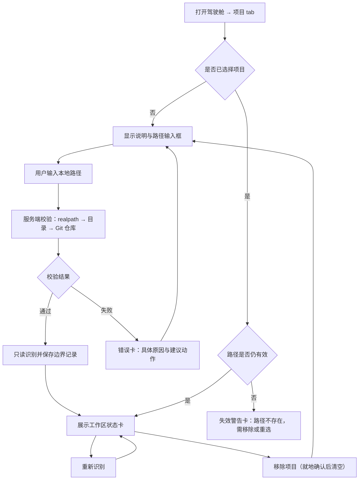
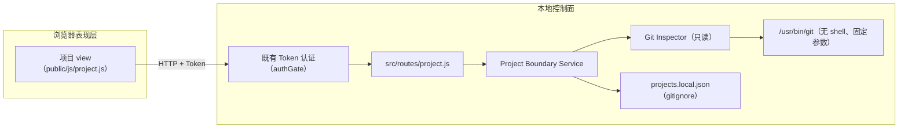

# S02 · Git 项目安全边界设计

> 设计决策 D1–D6 已由用户在 2026-08-06 确认（只读零写入、手动路径输入、服务端持久化、主页面新 view、medium 风险、三场景验收）；设计稿全文同日获用户批准（“全部同意”），标记 `accepted`。实现必须另按 `writing-plans` 生成的逐步计划执行。

## 1. 这次要交付什么

用户在本地驾驶舱的主页面新增「项目」标签页，可以：

1. 手动输入一个本地路径，选择一个 Git 项目；
2. 系统对该项目做**只读识别**：仓库根、当前分支或 detached、是否有提交、已暂存/未暂存/未跟踪/冲突文件、最近一次提交、远端列表；
3. 看懂识别结果，尤其是「这个仓库现在有哪些既有改动」；
4. 刷新识别、移除项目选择；
5. 重启服务后选择仍然保留；路径失效时明确提示失效而不是静默沿用。

可观察起点是「未选择项目」；可观察终点是「一个真实 Git 项目被选择、识别结果准确展示、重启后仍在、移除后清空」。

S02 建立的是**边界记录与可见性**：它把「项目在哪、现在什么状态」变成驾驶舱的可信事实，供 S03 的 Pi 受控运行约束工作目录、供 S05 的恢复对比基线。S02 本身不强制执行边界，也不做任何恢复动作。

## 2. 已确认约束

- D1：S02 只读。不做任何 Git 写操作（不 stash/commit/branch/checkout/clean），不创建恢复点；恢复能力属于 S05。
- D2：项目选择 = 手动输入路径 + 服务端校验；不做目录浏览 API，不做原生文件选择器（本地 Web 无法使用）。
- D3：选择状态持久化在服务端本地文件 `projects.local.json`，加入 `.gitignore`；不使用浏览器 localStorage。
- D4：UI 为主页面新增「项目」view，与 console/install/chat 并列，不新造页面。
- D5：切片风险 medium；验证深度按 medium 执行（自动化测试优先 + 规格/代码审查 + 明确回退方式）。
- D6：真实验收三场景：本仓库（有未提交改动）、一个干净仓库、一个非 Git 目录。
- v0.1 只支持一个 Git 项目；选择新项目即替换旧选择。
- 沿用 S01 的装配模式：Service → 认证路由 → 前端脚本独立成链；不修改护航、群聊、终端、安装、启动链路。
- 秘密规则不变：本切片不接触任何 Provider Key；`projects.local.json` 只含路径与状态快照，仍不进 Git。

## 3. 方案比较

| 方案 | 做法 | 优点 | 主要问题 | 结论 |
|---|---|---|---|---|
| A. 复用 launch/terminal 链路做 Git 检查 | 用现有命令执行通道跑 git 命令 | 不新增文件 | 高权限通道混入只读检查，边界混乱；无法持久化选择；无法做结构化状态 | 不采用 |
| B. 独立 Git Inspector + Project Boundary Service + 新 view | 新建只读 Git 适配器、边界状态服务、认证路由和前端 view | 与 S01 同构，可测试；选择状态成为服务端事实；为 S03/S05 留好接口 | 新增约 5 个源文件 + 4 个测试文件 | **推荐** |
| C. 顺带实现恢复点（stash/标记提交） | 选择时直接创建保护性快照 | 一步到位 | 违反 D1；引入 Git 写操作风险，把 S05 的决策提前 | 不采用 |

推荐 B。依赖方向与 S01 一致：`Git Inspector（适配层）→ Project Boundary Service（领域层）→ 认证路由（应用层）→ 前端 view（表现层）`。

## 4. 用户流程与界面状态



### 4.1 「项目」view 形态

- **未选择态**：一段直白说明（这里做什么、不做什么：只读识别，不会改动仓库），路径输入框（`autocomplete="off"`、`spellcheck="false"`），按钮「选择并识别」。
- **已选择态**：
  - 仓库根卡片：显示输入路径；若 realpath 不同，同时显示解析后的真实路径；
  - 分支徽章：分支名，或 `detached`、`尚无提交` 徽章；
  - 最近提交：短哈希 + 日期 + 首行 subject（截断）；
  - 计数格：已暂存 / 未暂存 / 未跟踪 / 冲突 四个数字；
  - 文件列表：`porcelain` 状态码 + 路径，等宽字体，超过上限时显示截断提示；
  - 远端：远端名列表或「无远端」；
  - 边界提示（诚实文案）：「该仓库根将作为后续 Pi 任务的工作边界（S03 生效）」；
  - 操作：「重新识别」「移除项目」。
- **失效态**：警告卡说明路径已不存在，提供「移除」与重新输入入口。
- **错误卡**：沿用护航样式——发生了什么、影响、建议动作。

### 4.2 前端数据规则

- 所有动态内容用 `textContent` / 安全构建 DOM，不使用 `innerHTML` 插入动态值（路径与文件名是外部输入）。
- 不在浏览器侧持久化任何项目信息；一切以服务端状态为准。
- 移除项目需要一次就地确认（与 S01 删除 Key 同级模式，不叠加多层弹窗）。

## 5. 运行架构



### 5.1 依赖规则

- Git Inspector 是唯一接触 `git` 子进程的地方；Service、路由、前端都不直接调用子进程。
- Project Boundary Service 不导入护航、Agent 调用器、终端、安装链路；反向也不允许。
- 路由层只暴露白名单字段，不透传原始错误对象或原始 git 输出。

## 6. Git Inspector 设计（只读适配层）

### 6.1 命令白名单

全部为只读命令，使用绝对路径 `/usr/bin/git`（构造函数可注入替代路径以便测试），`child_process.spawnFile`、无 shell、参数数组、`cwd` 为目标路径、单命令 10 秒超时：

| 用途 | 命令 |
|---|---|
| 是否仓库 | `rev-parse --is-inside-work-tree` |
| 仓库根 | `rev-parse --show-toplevel` |
| 当前分支 | `symbolic-ref --short -q HEAD`（失败→detached 或无提交） |
| 是否有提交 | `rev-parse --verify --short HEAD` |
| 最近提交 | `log -1 --format=%h%x09%cs%x09%s` |
| 工作区状态 | `status --porcelain=v1`（默认 untracked=normal，输出上限见 6.2） |
| 远端 | `remote` |

代码中不存在白名单之外的 git 动词；测试断言这一点（见 §12.1）。

### 6.2 输出边界

- `status --porcelain` 原始输出上限 512 KB、条目上限 200 条，超出即截断并标记 `truncated: true`；
- 计数口径：X 位非空格非 `?` 记为已暂存；Y 位非空格记为未暂存；`??` 记为未跟踪；任一位为 `U` 或 `AA`/`DD` 记为冲突；
- 未跟踪使用默认折叠（整个未跟踪目录只显示目录名），避免巨型未跟踪目录枚举拖垮识别；
- 最近提交 subject 截断 200 字符；
- 所有 git 输出只解析需要的字段，原始输出不进入日志、不进入 HTTP 响应。

### 6.3 路径安全

- 输入长度上限 1024 字符，trim，拒绝空值与 NUL 字节；
- `fs.realpath` 解析符号链接后，必须存在且是目录；
- 拒绝 `/` 与用户主目录本身（`os.homedir()` 的 realpath）；
- 若 realpath 与输入不同，UI 同时展示两者；
- 是否为 Git 仓库以 `rev-parse` 为准，不靠猜测 `.git` 目录。

## 7. Project Boundary Service 设计（领域层）

### 7.1 状态模型

```text
no_project ──select 成功──> selected
selected ──refresh──> selected（更新快照）
selected ──路径失效──> stale（保留记录，提示处理）
selected / stale ──clear──> no_project（幂等）
select 新路径 = 替换旧选择
```

### 7.2 持久化

- 文件：`projects.local.json`（仓库根，加入 `.gitignore`），格式：

```json
{
  "version": 1,
  "project": {
    "inputPath": "…",
    "resolvedPath": "…",
    "repoRoot": "…",
    "selectedAt": "ISO8601",
    "selectionSnapshot": { "…识别快照…" }
  }
}
```

- 写入使用临时文件 + rename，避免半写状态；启动时读取，文件损坏时按 `no_project` 处理并记录一条非敏感警告；
- `selectionSnapshot` 是选择时刻的基线快照，S05 的恢复对比将以此为准，因此选择成功后立即固化。

### 7.3 失效检测

- 每次读取/刷新时检查 `repoRoot` 是否仍是目录且仍是 Git 仓库；不是则状态为 `stale`，不自动删除记录；
- `stale` 时 refresh 返回失效错误码，clear 仍可执行。

## 8. 状态与错误模型

### 8.1 稳定错误码

| 错误码 | 触发条件 | 建议动作 |
|---|---|---|
| `invalid_path` | 空、超长、含 NUL | 输入有效的本地绝对路径 |
| `path_not_found` | realpath 解析失败或不存在 | 检查路径拼写 |
| `not_a_directory` | 目标是文件 | 输入目录路径 |
| `forbidden_root` | 目标是 `/` 或主目录本身 | 选择具体项目目录 |
| `not_a_git_repo` | rev-parse 判定非仓库 | 先 `git init` 或选择其他目录（S02 不代建仓库） |
| `git_unavailable` | 找不到 git 可执行文件 | 安装 Xcode Command Line Tools |
| `git_timeout` | 单命令超过 10 秒 | 检查磁盘/仓库规模后重试 |
| `git_failed` | git 非零退出或输出无法解析 | 查看建议；不暴露原始 stderr |
| `no_project_selected` | 未选择时 refresh | 先选择项目 |
| `project_stale` | 已选路径失效 | 移除或重新选择 |

### 8.2 HTTP 约定

沿用 S01：成功 200 + 白名单字段；失败按语义返回 4xx/5xx + `{ ok: false, code, message, action, retryable }`（与护航路由错误形状一致）；`message` 为固定中文文案，不透传 git 原始输出。

## 9. 本地 API 契约

所有接口位于既有 `authGate` 之后（Token 认证）：

| 方法 | 路径 | 作用 |
|---|---|---|
| GET | `/api/project/status` | 当前选择与最新识别快照；未选择返回 `{ selected: false }` |
| POST | `/api/project/select` | body `{ "path": "…" }`；校验 + 识别 + 持久化，返回完整快照 |
| POST | `/api/project/refresh` | 对已选项目重新识别；幂等只读 |
| POST | `/api/project/clear` | 移除选择；幂等 |

响应快照字段：`selected, inputPath, resolvedPath, repoRoot, selectedAt, stale, inspection: { inspectedAt, branch, detached, hasCommits, headCommit, counts: { staged, unstaged, untracked, conflicted }, entries[], truncated, remotes[] }`。

## 10. 精确修改范围

### 10.1 计划新增

| 文件 | 职责 |
|---|---|
| `src/services/git-inspector.js` | 只读 Git 适配器（命令白名单、超时、输出边界） |
| `src/services/project-boundary.js` | 选择状态机、持久化、失效检测 |
| `src/routes/project.js` | 认证后的 4 个 HTTP 契约 |
| `public/js/project.js` | 项目 view 渲染与交互 |
| `public/css/project.css` | view 样式（沿用 escort.css 模式） |
| `test/git-inspector.test.js` | 真实临时仓库上的识别测试 |
| `test/project-boundary.test.js` | 状态机、持久化、失效、路径安全 |
| `test/project-routes.test.js` | 认证、错误码、字段白名单 |
| `test/project-ui.test.js` | 静态装配与 DOM 安全回归 |

### 10.2 计划修改

| 文件 | 修改内容 |
|---|---|
| `src/server.js` | 构造 gitInspector/projectBoundary 并挂载 `projectRoutes(app, …)`（约 3 行，跟随 escort 装配模式） |
| `public/index.html` | subbar 增加「项目」tab、`#views` 增加 `project-view`、引入 project.css/project.js |
| `public/js/index.js` | `switchView` 增加一行 `project-view` 可见性切换（实现时补录的范围细节，同模式一行改动） |
| `.gitignore` | 增加 `projects.local.json` 一行（见 §13 第 6 条的用户确认事项） |

### 10.3 禁止修改

`src/agent-caller.js`、`src/routes/api.js`、`public/js/chat.js`、`public/vendor/`、`tools.json`、`.token`、`agents.config.json`、`src/terminal.js`、`src/routes/launch.js`、`src/routes/install.js`、S01 护航全部文件（`src/providers/`、`src/services/credential-store.js`、`src/services/escort-service.js`、`src/routes/escort.js`、`public/js/escort.js`、`public/css/escort.css`、`test/escort-*.test.js`、`test/credential-store.test.js`、`test/deepseek-provider.test.js`）。发现 S01 缺陷时单独补回归测试，不混入本切片。

## 11. 两个专注工作段

### 工作段一：只读识别与边界服务

Git Inspector + Project Boundary Service + 后端测试 + server.js 装配。验收：临时仓库夹具上的全部识别场景通过，路径安全用例通过，`npm test` 全绿。

### 工作段二：网页闭环与真实验收

project.js/project.css + index.html view + 路由层 HTTP 测试 + UI 静态回归。验收：隔离端口启动，用户按 §12.2 完成三场景真实验收并回写 NOW.md。

## 12. 验证方案

### 12.1 自动证据

- `npm test`：既有 62 项 + 新增约 40 项全部通过；
- Git Inspector 测试使用 `os.tmpdir()` 下临时创建的真实仓库夹具（`git init` 显式 `-c init.defaultBranch=main` 与 `-c user.name/email`，不依赖用户全局配置），覆盖：干净仓库、已暂存/未暂存/未跟踪/冲突、detached、无提交新仓库、非仓库目录、git 不可用（注入假二进制路径）、超时（注入慢二进制）、条目截断（注入小上限）、命令白名单只读断言；
- 测试全程不写入任何真实仓库，不使用本仓库作为夹具；
- 新增与装配文件 `node --check`；`git diff --check`；隔离端口 `/api/health`；
- 严格结构校验 `validate-project-state.mjs . --strict`。

### 12.2 人工验收（三场景，D6）

1. **本仓库（有未提交改动）**：输入本仓库路径，确认识别出 `.gitignore` 的未暂存改动、分支名与最近提交与 `git status` 事实一致；验收前后各跑一次 `git status --porcelain`，证明 S02 零写入（diff 必须一致，且只有 AI 按流程提交的 docs 记录提交）。
2. **干净仓库**：在 `/tmp` 新建并提交一次的仓库，确认计数全 0、分支与提交正确。
3. **非 Git 目录**：输入非仓库目录与不存在路径，确认得到可区分的错误卡。
4. **持久化与失效**：重启服务后选择仍在；删除临时仓库后刷新显示失效；移除后状态清空；重复移除不报错。

### 12.3 零写入证明

- 代码层：Git Inspector 命令白名单只读，测试断言无写动词；
- 行为层：验收场景 1 的前后 `git status --porcelain` 对比；
- 文件层：目标仓库内不新增任何文件（识别不产生 `.git` 写入、不产生锁文件残留）。

## 13. 安全审查清单

1. 子进程：绝对路径 + 参数数组 + 无 shell + cwd 限定 + 超时；无用户输入直接进入命令参数（路径只进 cwd，且经过 realpath 校验）。
2. 路径穿越：realpath 解析符号链接；拒绝 `/` 与主目录本身；识别结果中的路径不回传给子进程执行。
3. 输出注入：git 输出仅解析固定字段；文件名等外部数据在前端一律 `textContent`。
4. 数据暴露：响应字段白名单；原始 stderr 不进响应与日志；`projects.local.json` 不含秘密且被忽略。
5. 权限：沿用 127.0.0.1 + Token；无新增免认证接口。
6. `.gitignore` 特殊事项：该文件当前含有用户未提交的 `.superpowers/` 行。实现时新增 `projects.local.json` 行，**暂存策略需在实现时单独征求用户同意**（两行一并提交，或保持全部未暂存），不得擅自把用户改动带入提交。
7. 回退方式：本切片全部为新增文件 + 三处小装配；回退 = revert 对应提交，无数据迁移。

## 14. 非功能目标与残余风险

- 单项目识别目标 < 2 秒（常规仓库）；巨型仓库以超时和截断兜底。
- 残余风险：`git status` 在异常巨大仓库可能逼近超时 → 截断 + 可重试已覆盖；symlink 指向的仓库被移动后失效 → stale 检测覆盖；git 输出格式随版本变化 → 解析失败归类 `git_failed`，不崩溃。
- 明确不承诺：系统级沙箱、多项目、恢复点、边界强制执行（S03）。

## 15. 已确认决定（2026-08-06，用户）

- D1 只读零写入；恢复点推迟 S05。
- D2 手动路径输入 + 服务端校验；无目录浏览 API。
- D3 服务端 `projects.local.json` 持久化，加入 `.gitignore`。
- D4 主页面新增「项目」view。
- D5 风险 medium。
- D6 三场景真实验收（本仓库/干净仓库/非 Git 目录）。

## 16. Definition of Ready 对照

| 项 | 状态 |
|---|---|
| 产品基线已接受 | ✅ 2026-08-05 |
| 一句话目标与可观察起止 | ✅ §1 |
| 可执行验收标准与非目标 | ✅ §12 / §1、§2 |
| 验收—证据映射 | ✅ §12（实现计划中细化为表格） |
| 风险分级与验证策略 | ✅ medium，§12–§13 |
| 文件范围与保护路径 | ✅ §10 |
| 分支提案 | ✅ `codex/v0.1-s02-git-safety-boundary`，自 `main` 当前 HEAD |
| 既有改动分类与保护 | ✅ 仅 `.gitignore` 用户行，策略见 §13.6 |
| 无未决关键决策 | ⏳ 待用户确认本设计稿 |
| 实现计划深度 | 中风险：实现前另出逐步实现计划 |
