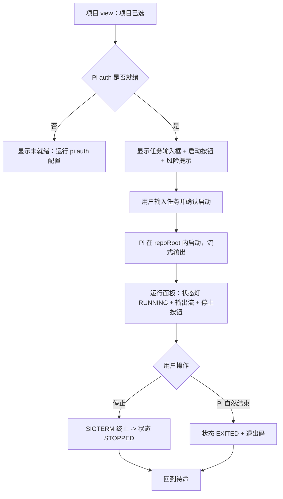
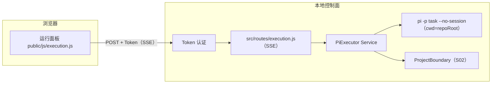

# S03 · Pi 受控运行设计

> 设计决策 D1–D6 已由用户在 2026-08-06 确认（Pi 认证独立、暂停=停止、边界=固定 cwd、UI 在项目 view、风险 high、测试仓库验收）。本文稿为 `draft`，待用户确认后标记 `accepted`。

## 1. 这次要交付什么

用户在项目 view 选择一个 Git 项目后，可以：

1. 看到该项目的边界已就绪（S02 记录的 repoRoot）；
2. 输入一条明确的任务提示词；
3. 确认风险提示后，启动 Pi 在**该项目目录内**执行；
4. 实时观察 Pi 的流式输出与运行状态；
5. 随时停止（SIGTERM 终止）当前运行；
6. 运行结束后看到退出状态与输出摘要。

可观察起点是「项目已选，Pi 待命」；可观察终点是「Pi 在项目内完成一次任务，输出可见，停止有效，全程不越界」。

S03 建立的是**受控执行能力**：把 Pi 从「在主目录自由运行」变成「在用户选定的项目内受控运行，可观察、可停止」。它不实现真正的暂停/恢复（Pi `-p` 是单次执行），不实现沙箱隔离（Pi 拥有用户完整权限），不做会话级上下文恢复。

## 2. 已确认约束

- D1：Pi 认证独立。S03 不把护航的 DeepSeek Key 传给 Pi；只调 `pi auth check` 检查就绪。Pi 用自己的 provider/认证。
- D2：暂停 = 停止。Pi `-p` 单次执行无真暂停；S03 实现「启动 + 停止（SIGTERM）+ 流式观察」。
- D3：边界 = 固定 cwd。Pi 的 `cwd` = S02 选定项目的 `repoRoot`。Pi 在该目录内有完整用户权限（无沙箱）；UI 明确告知风险，用户每次确认才启动。
- D4：UI 在项目 view 内。选项目后出现任务输入 + Pi 运行面板（流式输出、状态灯、停止按钮）。
- D5：风险 high。开工前完成威胁分析；实现时先建可替换边界和停止语义。
- D6：真实验收用测试仓库执行最小任务，验证 cwd、输出、停止与不越界。
- Pi 固定版本 `0.84.1`。
- 沿用独立链路模式：Pi Executor Service -> 认证 SSE 路由 -> 项目 view 内运行面板；不修改 agent-caller.js、群聊、终端、安装链路。

## 3. 方案比较

| 方案 | 做法 | 优点 | 主要问题 | 结论 |
|---|---|---|---|---|
| A. 复用 agent-caller.js | 在现有 callAgent 上加 cwd 参数 | 不新增文件 | cwd=HOME 硬编码；群聊与执行耦合；无法独立控制生命周期 | 不采用 |
| B. 独立 Pi Executor + SSE 路由 + 运行面板 | 新建只读执行服务、SSE 路由和运行面板，独立于群聊 | 边界可控；生命周期独立；可测试 | 新增约 5 个源文件 + 3 个测试 | **推荐** |
| C. 先做完整会话恢复 | 实现暂停/恢复/会话续传 | 长期最完整 | 远超 S03；Pi `-p` 不支持；风险极高 | 暂不采用 |

推荐 B。依赖方向：`PiExecutor（执行适配层）-> Execution Route（SSE）-> 项目 view 运行面板`。PiExecutor 不导入 agent-caller、群聊或护航。

## 4. 用户流程与界面状态



### 4.1 运行面板形态

- **待命态**：风险提示（「Pi 将在此项目目录内执行，拥有你的完整权限」）、任务输入框（多行，上限 4000 字符）、「启动 Pi」按钮。
- **运行态**：状态灯 RUNNING、流式输出区（等宽字体，自动滚动，上限 256KB 显示）、「停止」按钮、已运行时长。
- **结束态**：状态 EXITED/STOPPED、退出码、输出摘要、「重新启动」入口。
- **错误态**：发生了什么、影响、建议动作（沿用护航/项目错误卡样式）。

### 4.2 前端数据规则

- 任务文本用 `textContent` 构建；输出流用 `textContent` 追加（不用 innerHTML）。
- 不在浏览器侧持久化任务或输出；一切以服务端 SSE 为准。
- 同时只允许一个 Pi 运行；运行中禁用启动按钮。
- SSE 连接断开后自动重连一次获取状态。

## 5. 运行架构



### 5.1 依赖规则

- PiExecutor 是唯一接触 Pi 子进程的地方。
- 启动前必须从 ProjectBoundary 取到当前选择；未选或失效时拒绝。
- 同一时刻最多 1 个 Pi 运行在内存中。
- 不导入 agent-caller.js、群聊路由、护航或终端。

## 6. PiExecutor 设计

### 6.1 Pi 调用契约

固定调用（独立于 agent-catalog，避免群聊耦合）：

```text
/usr/bin/env pi -p "<task>" --no-session
cwd = selected project repoRoot
env = process.env（Pi 需要 PATH 和自身配置）
stdio = ["ignore", "pipe", "pipe"]
```

不传 `--model`（用 Pi 默认 provider/model）；不传 `--api-key`（Pi 用自身 auth）；不传 `--thinking`（用默认）。

### 6.2 Auth 就绪检查

启动前异步执行 `pi auth check --json`（超时 10 秒）；非零退出或 JSON 表示未就绪时，返回 `pi_not_authenticated` 错误，建议用户在终端运行 `pi auth` 配置。不读取或传递任何密钥。

### 6.3 进程生命周期

```text
idle ──start──> running ──stop──> stopped
running ──Pi exit 0──> exited
running ──Pi exit !=0──> error
running ──spawn fail──> spawn_failed
running ──server shutdown──> stopped（SIGTERM 清理）
```

- **start(task)**：校验 project 已选且非 stale -> check auth -> spawn Pi -> 注册进程 -> 返回 runId
- **stop()**：SIGTERM -> 3 秒后 SIGKILL -> 注销进程 -> 状态 stopped
- **stream**：stdout chunk -> SSE event；stderr 仅用于错误归类，不透传原文
- **超时**：默认 600 秒（10 分钟），可配置；超时后 SIGTERM
- **输出上限**：stdout 累计 512KB 后截断，标记 truncated
- **并发**：running 时拒绝新 start，返回 `busy`

### 6.4 安全边界

- task 输入：trim，长度上限 4000 字符，拒绝 NUL
- cwd：严格来自 ProjectBoundary 的 `repoRoot`（已经 S02 realpath 校验）
- 无沙箱：Pi 继承当前用户权限，UI 必须在启动前显示风险确认
- 进程清理：服务关闭时对所有 running 进程发 SIGTERM
- 不传密钥：Pi auth 完全独立

## 7. 状态与错误模型

### 7.1 运行状态

| 状态 | 含义 |
|---|---|
| `idle` | 无运行 |
| `running` | Pi 正在执行 |
| `stopped` | 用户主动终止 |
| `exited` | Pi 正常退出（exit 0） |
| `error` | Pi 异常退出或启动失败 |

### 7.2 稳定错误码

| 错误码 | 触发 | 建议 |
|---|---|---|
| `no_project_selected` | 未选项目 | 先选择项目 |
| `project_stale` | 项目路径已失效 | 移除或重新选择 |
| `pi_not_found` | 找不到 pi 命令 | 安装 Pi CLI |
| `pi_not_authenticated` | pi auth check 未就绪 | 在终端运行 `pi auth` 配置 |
| `invalid_task` | 任务为空或超长 | 输入有效任务 |
| `busy` | 已有运行中任务 | 先停止当前运行 |
| `spawn_failed` | 启动失败 | 检查 Pi 安装后重试 |
| `timeout` | 运行超时 | 检查任务复杂度或停止后重试 |
| `internal_error` | 未知错误 | 重新加载页面 |

### 7.3 HTTP 与 SSE 约定

- 成功响应 `{ ok: true, ... }`；失败 `{ ok: false, code, message, action, retryable }`（与护航/项目路由同构）。
- SSE 事件：`start`（runId, startedAt）、`chunk`（text）、`status`（状态变化）、`done`（exitCode, truncated, durationMs）、`error`（code, message）。

## 8. 本地 API 契约

| 方法 | 路径 | 作用 |
|---|---|---|
| GET | `/api/project/execution/status` | 当前运行状态与最近一次结果 |
| POST | `/api/project/execution/start` | body `{ task }`；返回 SSE 流 |
| POST | `/api/project/execution/stop` | 终止当前运行 |

SSE 事件格式沿用群聊 SSE（`event: <type>\ndata: <json>\n\n`）。

## 9. 精确修改范围

### 9.1 计划新增

| 文件 | 职责 |
|---|---|
| `src/services/pi-executor.js` | Pi 受控执行：auth 检查、spawn(cwd=repoRoot)、流式输出、停止、超时、进程清理 |
| `src/routes/execution.js` | SSE start + stop + status 认证契约 |
| `public/js/execution.js` | 运行面板渲染与 SSE 消费 |
| `public/css/execution.css` | 面板样式 |
| `test/pi-executor.test.js` | 用假 pi 二进制夹具测试生命周期、流式、停止、超时、auth 检查 |
| `test/execution-routes.test.js` | 认证、错误映射、SSE 事件格式 |
| `test/execution-ui.test.js` | 静态装配与 DOM 安全回归 |

### 9.2 计划修改

| 文件 | 修改 |
|---|---|
| `src/server.js` | 构造 piExecutor 并挂载 executionRoutes（约 3 行） |
| `public/index.html` | 项目 view 内增加运行面板容器 + 引入 execution.css/js |
| `public/js/project.js` | 项目已选时渲染运行面板入口（或由 execution.js 自行挂载到约定容器） |

### 9.3 禁止修改

`src/agent-caller.js`、`src/routes/api.js`、`public/js/chat.js`、`public/vendor/`、`tools.json`、`.token`、`agents.config.json`、`src/terminal.js`、`src/routes/launch.js`、`src/routes/install.js`、S01 护航全部文件、S02 项目边界全部文件（`src/services/git-inspector.js`、`src/services/project-boundary.js`、`src/routes/project.js`、`public/js/project.js`、`public/css/project.css`）。发现缺陷时单独补回归测试，不混入本切片。

## 10. 两个专注工作段

### 工作段一：Pi Executor + 后端测试

PiExecutor Service（auth check + spawn + stream + stop + timeout + cleanup）+ 后端测试（假 pi 二进制夹具）。验收：生命周期、流式、停止、超时、auth 检查、并发拒绝全部通过。

### 工作段二：SSE 路由 + 运行面板 + 真实验收

execution.js/css + index.html 装配 + SSE 路由 + UI 回归 + 用户用测试仓库完成真实验收。

## 11. 验证方案

### 11.1 自动证据

- `npm test`：既有 109 + 新增约 25 项全部通过；
- PiExecutor 测试使用假 pi 二进制（输出 chunk 后退出 / 模拟 auth 失败 / 模拟超时），不发起真实 API 请求；
- 命令行只含 `-p`、`--no-session`，不传 `--api-key`（测试断言）；
- 新增文件 `node --check`；`git diff --check`；隔离端口健康检查；严格结构校验。

### 11.2 人工验收（D6）

1. 在测试仓库（`/tmp/s03-acceptance`，git init + 1 提交）选择项目；
2. 输入最小任务（如「列出当前目录的文件」）；
3. 确认风险提示后启动 Pi；
4. 验证：输出流式可见、cwd 正确（Pi 在测试仓库内执行）、停止按钮有效、退出状态正确；
5. 验证不越界：Pi 未在测试仓库外产生文件（前后 `find /tmp/s03-acceptance` 对比）；
6. 验证未选项目时无法启动；
7. 验证运行中无法二次启动（busy）。

### 11.3 安全验证

- 启动前必须显示风险确认；
- 不传 `--api-key`（argv 审计）；
- 进程在服务关闭时被 SIGTERM 清理（无孤儿进程）；
- Pi 在 cwd 内执行，cwd 来自 S02 校验过的 repoRoot。

## 12. 安全审查清单

1. 子进程：无 shell、参数数组、cwd 限定为 repoRoot、超时回收、服务关闭清理。
2. 认证：不传密钥；Pi auth 独立检查。
3. 输入：task 长度上限、无 NUL、trim。
4. 输出：stdout 截断上限、stderr 不透传原文、前端 textContent 渲染。
5. 并发：单运行实例、busy 拒绝。
6. 权限告知：UI 启动前明确显示「Pi 拥有完整用户权限，无沙箱」。
7. 回退：全部新增文件；revert 即回退，无数据迁移。

## 13. 非功能目标与残余风险

- Pi 首次启动应在 3 秒内开始流式输出（取决于 Pi 自身冷启动）。
- 残余风险：Pi 可能执行破坏性命令（如 `rm -rf`）--这是编码 Agent 的本质，用户每次启动需确认；Pi auth 可能过期--auth check 覆盖；Pi 输出格式可能随版本变化--解析容错。
- 明确不承诺：沙箱隔离、暂停/恢复、会话续传、多任务并发、费用控制、输出结构化解析。

## 14. Definition of Ready 对照

| 项 | 状态 |
|---|---|
| 产品基线已接受 | ✅ |
| 一句话目标与可观察起止 | ✅ §1 |
| 验收标准与非目标 | ✅ §11 / §1、§2 |
| 验收-证据映射 | ✅ §11（实现计划细化） |
| 风险分级与验证策略 | ✅ high，§11–§12 |
| 文件范围与保护路径 | ✅ §9 |
| 分支提案 | ✅ `codex/v0.1-s03-pi-controlled-run`，自 `main` 当前 HEAD |
| 既有改动分类与保护 | ✅ 工作区干净 |
| 无未决关键决策 | ⏳ 待用户确认本设计稿 |
| 实现计划深度 | 高风险：实现前另出逐步实现计划 |
